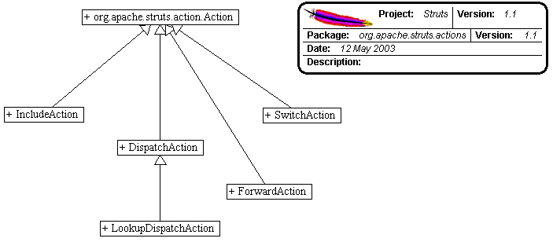

------------------------------------------------------------------------

 

<table>
<colgroup>
<col width="50%" />
<col width="50%" />
</colgroup>
<tbody>
<tr class="odd">
<td align="left">
<table>
<tbody>
<tr class="odd">
<td align="left"><a href="../../../../overview-summary.html.md"><strong>Overview</strong></a> </td>
<td align="left"> <strong>Package</strong> </td>
<td align="left">Class </td>
<td align="left"><a href="package-use.html.md"><strong>Use</strong></a> </td>
<td align="left"><a href="package-tree.html.md"><strong>Tree</strong></a> </td>
<td align="left"><a href="../../../../deprecated-list.html.md"><strong>Deprecated</strong></a> </td>
<td align="left"><a href="../../../../index-all.html.md"><strong>Index</strong></a> </td>
<td align="left"><a href="../../../../help-doc.html.md"><strong>Help</strong></a> </td>
</tr>
</tbody>
</table></td>
<td align="left"></td>
</tr>
<tr class="even">
<td align="left"> <a href="../../../../org/apache/struts/action/package-summary.html.md"><strong>PREV PACKAGE</strong></a>   <a href="../../../../org/apache/struts/apps/mailreader/dao/package-summary.html"><strong>NEXT PACKAGE</strong></a></td>
<td align="left"><a href="../../../../index.html.md?org/apache/struts/actions/package-summary.html"><strong>FRAMES</strong></a>    <a href="package-summary.html"><strong>NO FRAMES</strong></a>    
<a href="../../../../allclasses-noframe.html.md"><strong>All Classes</strong></a></td>
</tr>
</tbody>
</table>

------------------------------------------------------------------------

Package org.apache.struts.actions
---------------------------------

The actions package provides special adapters between the incoming HTTP request and the corresponding business logic.

**See:**
           [**Description**](#package_description)

**Interface Summary**

**[DownloadAction.StreamInfo](../../../../org/apache/struts/actions/DownloadAction.StreamInfo.html.md "interface in org.apache.struts.actions")**

The information on a file, or other stream, to be downloaded by the `DownloadAction`.

 

**Class Summary**

**[ActionDispatcher](../../../../org/apache/struts/actions/ActionDispatcher.html.md "class in org.apache.struts.actions")**

Action *helper* class that dispatches to a public method in an Action.

**[BaseAction](../../../../org/apache/struts/actions/BaseAction.html.md "class in org.apache.struts.actions")**

BaseAction is provided as an intermediate class for shared funtionality between `Action` and any stock implementation provided in this package.

**[DispatchAction](../../../../org/apache/struts/actions/DispatchAction.html.md "class in org.apache.struts.actions")**

An abstract **Action** that dispatches to a public method that is named by the request parameter whose name is specified by the `parameter` property of the corresponding ActionMapping.

**[DownloadAction](../../../../org/apache/struts/actions/DownloadAction.html.md "class in org.apache.struts.actions")**

This is an abstract base class that minimizes the amount of special coding that needs to be written to download a file.

**[DownloadAction.FileStreamInfo](../../../../org/apache/struts/actions/DownloadAction.FileStreamInfo.html.md "class in org.apache.struts.actions")**

A concrete implementation of the `StreamInfo` interface which simplifies the downloading of a file from the disk.

**[DownloadAction.ResourceStreamInfo](../../../../org/apache/struts/actions/DownloadAction.ResourceStreamInfo.html.md "class in org.apache.struts.actions")**

A concrete implementation of the `StreamInfo` interface which simplifies the downloading of a web application resource.

**[EventActionDispatcher](../../../../org/apache/struts/actions/EventActionDispatcher.html.md "class in org.apache.struts.actions")**

An Action helper class that dispatches to to one of the public methods that are named in the `parameter` attribute of the corresponding ActionMapping and matches a submission parameter.

**[EventDispatchAction](../../../../org/apache/struts/actions/EventDispatchAction.html.md "class in org.apache.struts.actions")**

An **Action** that dispatches to to one of the public methods that are named in the `parameter` attribute of the corresponding ActionMapping and matches a submission parameter.

**[ForwardAction](../../../../org/apache/struts/actions/ForwardAction.html.md "class in org.apache.struts.actions")**

An **Action** that forwards to the context-relative URI specified by the `parameter` property of our associated `ActionMapping`.

**[IncludeAction](../../../../org/apache/struts/actions/IncludeAction.html.md "class in org.apache.struts.actions")**

An **Action** that includes the context-relative URI specified by the `parameter` property of our associated `ActionMapping`.

**[LocaleAction](../../../../org/apache/struts/actions/LocaleAction.html.md "class in org.apache.struts.actions")**

Implementation of **Action** that changes the user's [`Locale`](http://java.sun.com/j2se/1.4.2/docs/api/java/util/Locale.html.md?is-external=true "class or interface in java.util") and forwards to a page, based on request level parameters that are set (language, country, & page).

**[LookupDispatchAction](../../../../org/apache/struts/actions/LookupDispatchAction.html.md "class in org.apache.struts.actions")**

An abstract **Action** that dispatches to the subclass mapped `execute` method.

**[MappingDispatchAction](../../../../org/apache/struts/actions/MappingDispatchAction.html.md "class in org.apache.struts.actions")**

An abstract **Action** that dispatches to a public method that is named by the `parameter` attribute of the corresponding ActionMapping.

**[SwitchAction](../../../../org/apache/struts/actions/SwitchAction.html.md "class in org.apache.struts.actions")**

A standard **Action** that switches to a new module and then forwards control to a URI (specified in a number of possible ways) within the new module.

 

Package org.apache.struts.actions Description
---------------------------------------------

The actions package provides special adapters between the incoming HTTP request and the corresponding business logic.

 

Package Specification
---------------------

\#\#\#\#\# FILL IN ANY SPECS NEEDED BY JAVA COMPATIBILITY KIT \#\#\#\#\#

-   [\#\#\#\#\# REFER TO ANY FRAMEMAKER SPECIFICATION HERE \#\#\#\#\#]()

Related Documentation
---------------------

For overviews, tutorials, examples, guides, and tool documentation, please see:

-   [\#\#\#\#\# REFER TO NON-SPEC DOCUMENTATION HERE \#\#\#\#\#]()

------------------------------------------------------------------------

 

<table>
<colgroup>
<col width="50%" />
<col width="50%" />
</colgroup>
<tbody>
<tr class="odd">
<td align="left">
<table>
<tbody>
<tr class="odd">
<td align="left"><a href="../../../../overview-summary.html.md"><strong>Overview</strong></a> </td>
<td align="left"> <strong>Package</strong> </td>
<td align="left">Class </td>
<td align="left"><a href="package-use.html.md"><strong>Use</strong></a> </td>
<td align="left"><a href="package-tree.html.md"><strong>Tree</strong></a> </td>
<td align="left"><a href="../../../../deprecated-list.html.md"><strong>Deprecated</strong></a> </td>
<td align="left"><a href="../../../../index-all.html.md"><strong>Index</strong></a> </td>
<td align="left"><a href="../../../../help-doc.html.md"><strong>Help</strong></a> </td>
</tr>
</tbody>
</table></td>
<td align="left"></td>
</tr>
<tr class="even">
<td align="left"> <a href="../../../../org/apache/struts/action/package-summary.html.md"><strong>PREV PACKAGE</strong></a>   <a href="../../../../org/apache/struts/apps/mailreader/dao/package-summary.html"><strong>NEXT PACKAGE</strong></a></td>
<td align="left"><a href="../../../../index.html.md?org/apache/struts/actions/package-summary.html"><strong>FRAMES</strong></a>    <a href="package-summary.html"><strong>NO FRAMES</strong></a>    
<a href="../../../../allclasses-noframe.html.md"><strong>All Classes</strong></a></td>
</tr>
</tbody>
</table>

------------------------------------------------------------------------

Copyright © 2000-2008 [Apache Software Foundation](http://www.apache.org/). All Rights Reserved.
