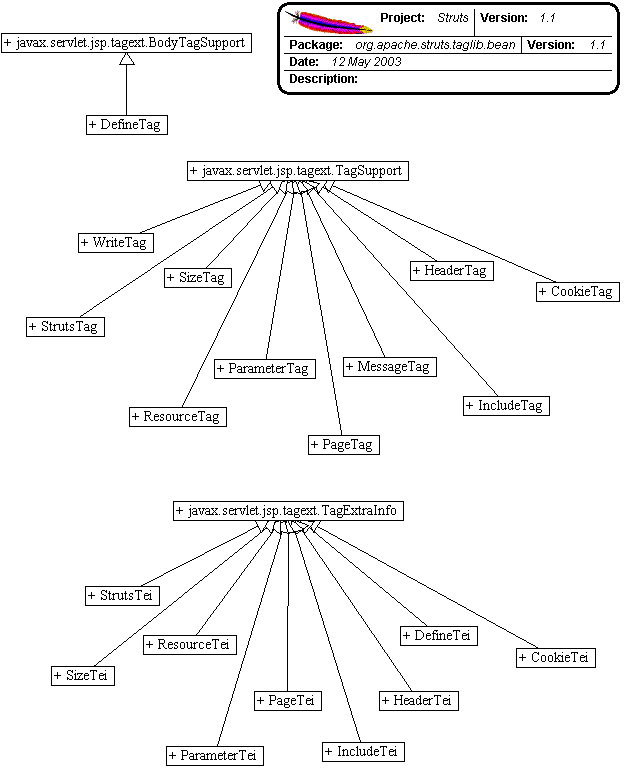

------------------------------------------------------------------------

 

<table>
<colgroup>
<col width="50%" />
<col width="50%" />
</colgroup>
<tbody>
<tr class="odd">
<td align="left">
<table>
<tbody>
<tr class="odd">
<td align="left"><a href="../../../../../overview-summary.html.md"><strong>Overview</strong></a> </td>
<td align="left"> <strong>Package</strong> </td>
<td align="left">Class </td>
<td align="left"><a href="package-use.html.md"><strong>Use</strong></a> </td>
<td align="left"><a href="package-tree.html.md"><strong>Tree</strong></a> </td>
<td align="left"><a href="../../../../../deprecated-list.html.md"><strong>Deprecated</strong></a> </td>
<td align="left"><a href="../../../../../index-all.html.md"><strong>Index</strong></a> </td>
<td align="left"><a href="../../../../../help-doc.html.md"><strong>Help</strong></a> </td>
</tr>
</tbody>
</table></td>
<td align="left"></td>
</tr>
<tr class="even">
<td align="left"> <a href="../../../../../org/apache/struts/taglib/package-summary.html.md"><strong>PREV PACKAGE</strong></a>   <a href="../../../../../org/apache/struts/taglib/html/package-summary.html"><strong>NEXT PACKAGE</strong></a></td>
<td align="left"><a href="../../../../../index.html.md?org/apache/struts/taglib/bean/package-summary.html"><strong>FRAMES</strong></a>    <a href="package-summary.html"><strong>NO FRAMES</strong></a>    
<a href="../../../../../allclasses-noframe.html.md"><strong>All Classes</strong></a></td>
</tr>
</tbody>
</table>

------------------------------------------------------------------------

Package org.apache.struts.taglib.bean
-------------------------------------

The "struts-bean" tag library contains JSP custom tags useful in defining new beans (in any desired scope) from a variety of possible sources, as well as a tag to render a particular bean (or bean property) to the output response.

**See:**
           [**Description**](#package_description)

**Class Summary**

**[CookieTag](../../../../../org/apache/struts/taglib/bean/CookieTag.html.md "class in org.apache.struts.taglib.bean")**

Define a scripting variable based on the value(s) of the specified cookie received with this request.

**[CookieTei](../../../../../org/apache/struts/taglib/bean/CookieTei.html.md "class in org.apache.struts.taglib.bean")**

Implementation of `TagExtraInfo` for the **cookie** tag, identifying the scripting object(s) to be made visible.

**[DefineTag](../../../../../org/apache/struts/taglib/bean/DefineTag.html.md "class in org.apache.struts.taglib.bean")**

Define a scripting variable based on the value(s) of the specified bean property.

**[DefineTei](../../../../../org/apache/struts/taglib/bean/DefineTei.html.md "class in org.apache.struts.taglib.bean")**

Implementation of `TagExtraInfo` for the **define** tag, identifying the scripting object(s) to be made visible.

**[HeaderTag](../../../../../org/apache/struts/taglib/bean/HeaderTag.html.md "class in org.apache.struts.taglib.bean")**

Define a scripting variable based on the value(s) of the specified header received with this request.

**[HeaderTei](../../../../../org/apache/struts/taglib/bean/HeaderTei.html.md "class in org.apache.struts.taglib.bean")**

Implementation of `TagExtraInfo` for the **header** tag, identifying the scripting object(s) to be made visible.

**[IncludeTag](../../../../../org/apache/struts/taglib/bean/IncludeTag.html.md "class in org.apache.struts.taglib.bean")**

Define the contents of a specified intra-application request as a page scope attribute of type `java.lang.String`.

**[IncludeTei](../../../../../org/apache/struts/taglib/bean/IncludeTei.html.md "class in org.apache.struts.taglib.bean")**

Implementation of `TagExtraInfo` for the **include** tag, identifying the scripting object(s) to be made visible.

**[MessageTag](../../../../../org/apache/struts/taglib/bean/MessageTag.html.md "class in org.apache.struts.taglib.bean")**

Custom tag that retrieves an internationalized messages string (with optional parametric replacement) from the `ActionResources` object stored as a context attribute by our associated `ActionServlet` implementation.

**[PageTag](../../../../../org/apache/struts/taglib/bean/PageTag.html.md "class in org.apache.struts.taglib.bean")**

Define a scripting variable that exposes the requested page context item as a scripting variable and a page scope bean.

**[PageTei](../../../../../org/apache/struts/taglib/bean/PageTei.html.md "class in org.apache.struts.taglib.bean")**

Implementation of `TagExtraInfo` for the **page** tag, identifying the scripting object(s) to be made visible.

**[ParameterTag](../../../../../org/apache/struts/taglib/bean/ParameterTag.html.md "class in org.apache.struts.taglib.bean")**

Define a scripting variable based on the value(s) of the specified parameter received with this request.

**[ParameterTei](../../../../../org/apache/struts/taglib/bean/ParameterTei.html.md "class in org.apache.struts.taglib.bean")**

Implementation of `TagExtraInfo` for the **parameter** tag, identifying the scripting object(s) to be made visible.

**[ResourceTag](../../../../../org/apache/struts/taglib/bean/ResourceTag.html.md "class in org.apache.struts.taglib.bean")**

Define a scripting variable based on the contents of the specified web application resource.

**[ResourceTei](../../../../../org/apache/struts/taglib/bean/ResourceTei.html.md "class in org.apache.struts.taglib.bean")**

Implementation of `TagExtraInfo` for the **resource** tag, identifying the scripting object(s) to be made visible.

**[SizeTag](../../../../../org/apache/struts/taglib/bean/SizeTag.html.md "class in org.apache.struts.taglib.bean")**

Define a scripting variable that will contain the number of elements found in a specified array, Collection, or Map.

**[SizeTei](../../../../../org/apache/struts/taglib/bean/SizeTei.html.md "class in org.apache.struts.taglib.bean")**

Implementation of `TagExtraInfo` for the **size** tag, identifying the scripting object(s) to be made visible.

**[StrutsTag](../../../../../org/apache/struts/taglib/bean/StrutsTag.html.md "class in org.apache.struts.taglib.bean")**

Define a scripting variable that exposes the requested Struts internal configuraton object.

**[StrutsTei](../../../../../org/apache/struts/taglib/bean/StrutsTei.html.md "class in org.apache.struts.taglib.bean")**

Implementation of `TagExtraInfo` for the **struts** tag, identifying the scripting object(s) to be made visible.

**[WriteTag](../../../../../org/apache/struts/taglib/bean/WriteTag.html.md "class in org.apache.struts.taglib.bean")**

Tag that retrieves the specified property of the specified bean, converts it to a String representation (if necessary), and writes it to the current output stream, optionally filtering characters that are sensitive in HTML.

 

Package org.apache.struts.taglib.bean Description
-------------------------------------------------

The "struts-bean" tag library contains JSP custom tags useful in defining new beans (in any desired scope) from a variety of possible sources, as well as a tag to render a particular bean (or bean property) to the output response.
 

[[Introduction]](#doc.Intro) [[Bean Properties]](#doc.Properties) [[Bean Creation]](#doc.Creation) [[Bean Output]](#doc.Output)

------------------------------------------------------------------------

### Introduction

Much of the power of JavaServer Pages (JSP) technology comes from the simple and powerful mechanisms by which the servlet that is generated automatically from your JSP source page can interact with JavaBeans that represent the computational state of your application. In standard JSP pages, the `<jsp:useBean>` tag is used create a bean (if necessary), as well as a "scripting variable" that can be used within scriptlets to refer to these beans.

The "struts-bean" tag library provides substantial enhancements to the basic capability provided by `<jsp:useBean>`, as discussed in the following sections:

-   [Bean Properties](#doc.Properties) - Extended syntax to refer to JavaBean properties with simple names (same as the standard JSP tags `<jsp:getProperty>` and `<jsp:setProperty>`), nested names (a property named `address.city` returns the value retrieved by the Java expression `getAddress().getCity()`), and indexed names (a property named `address[3]` retrieves the fourth address from the indexed "address" property of a bean).
-   [Bean Creation](#doc.Creation) - New JSP beans, in any scope, can be created from a variety of objects and APIs associated with the current request, or with the servlet container in which this page is running.
-   [Bean Output](#doc.Output) - Supports the rendering of textual output from a bean (or bean property), which will be included in the response being created by your JSP page.

See the [Bean Tags Reference](../../../../../../tagreference.html.md) for detailed information about the available tags in this tag library, and the valid attributes for each tag.
 

### Bean Properties

##### Common Tag Attributes

The tags in the "struts-bean" tag library (and, generally, in all tag libraries included with the Struts framework) share a common set of tag attributes that have the same meaning, no matter what tag they are used on. These common attributes include:

-   *id* - Names the scripting variable that will be created by this custom tag, as well as the key value used to locate this bean in the scope defined by the `scope` attribute.
-   *name* - Defines the key value by which an existing bean will be looked up in the scope defined by the `scope` attribute (if any), or by searching through the various scopes in the standard order (page, request, session, application).
-   *property* - Defines the name of a JavaBeans property, of the JSP bean identified by the `name` and (optional) `scope` attributes, whose value is to be used by this custom tag. If not specified, the bean identified by `name` is itself used as the value of interest. See below for more discussion about how a property can be referenced.
-   *scope* - Identifies the JSP scope ("page", "request", "session", or "application" within which a particular bean will be searched for (under the key specified by the `name` attribute) or created (under the key specified by the `id` attribute). If not specified, beans will generally be searched for in the order listed above, or created in page scope.

##### Property References

Struts tags that support the `property` tag generally also recognize a rich syntax for getting and setting properties. There are three types of references supported: simple, nested, and indexed.

*Simple References* - These are equivalent to the syntax you use with the standard `<jsp:getProperty>` and `<jsp:setProperty>` tags. A reference to a property named "foo" is converted into a method call to `getFoo()` or `setFoo(value)` (as appropriate), using the standard JavaBeans Specification naming conventions for bean properties. Struts uses the standard Java introspection APIs to identify the names of the actual property getter and setter methods, so your beans can provided customized method names through the use of a `BeanInfo` class. See the JavaBeans Specification, available at <http://java.sun.com/products/javabeans/> , for more information.

*Nested References* - Nested references are used to access a property through a hierarchy of property names separated by periods ("."), similar to the way that nested properties are accessed in JavaScript. For example, the following property reference in a getter (such as the `<bean:define>` tag discussed below):

     property="foo.bar.baz"

is translated into the equivalent the Java expression:

     getFoo().getBar().getBaz()

If a nested reference is used in a setter (such as when an input form is processed), the property setter is called on the **last** property in the chain. For the above property reference, the equivalent Java expression would be:

     getFoo().getBar().setBaz(value)

*Indexed References* - Subscripts can be used to access individual elements of properties whose value is actually an array, or whose underlying JavaBean offers indexed getter and setter methods. For example, the following property reference in a getter (such as the `<bean:define>` tag discussed below):

     property="foo[2]"

is translated into the equivalent of the Java expression:

     getFoo(2);

while the same property reference in a setter would call the equivalent of:

     setFoo(2, value)

As you can see from the above translations, the subscripts used in indexed references are **zero relative** (that is, the first element in an array is `foo[0]`), just as is true in the Java language.

*Combined References* - Nesting and indexing can be combined in arbitrary ways, so that expressions like `foo.bar[0].baz[2]` are legal. You must be careful, of course, to ensure that the actual beans being accessed by these references have properties of the appropriate names and types. Otherwise, JSP runtime exceptions will be thrown.

See the JavaDocs for [PropertyUtils](http://jakarta.apache.org/commons/beanutils/api/org/apache/commons/beanutils/PropertyUtils.html.md) for more detailed information about the mechanisms that Struts uses to access properties in a general way, through Java reflection APIs.

------------------------------------------------------------------------

### Bean Creation

##### Introduction

New beans can be created, and introduced into one of the four standard JSP scopes (page, request, session, and application) through a variety of techniques. The following subsections describe the use of the following approaches:

-   Java Code in Action Classes
-   Java Code in Scriptlets
-   The Standard `<jsp:useBean>` Tag
-   The Struts `<bean:define>` Tag
-   Other Struts Copying Tags

##### Java Code in Action Classes

Because the JSP pages are compiled into Servlets, your `Action` classes that are invoked by the Struts controller servlet have convenient access to three of the four standard JSP scopes (request, session, and application). It is very common practice for the business logic contained in your `Action` class to create results that are stored in request or session scope, which will be used by a JSP page you forward control to in rendering the next page of the user interface.

*Request Scope* - To store a bean in request scope under name "cust", your `Action` class would execute code similar to this:

     Customer customer = ... create or acquire a customer reference ...;
        request.setAttribute("cust", customer);

*Session Scope* - To store a bean in session scope under name "user" (perhaps in a logon action), your `Action` class would execute code similar to this:

     User user = ... look up valid user in the database ...;
     HttpSession
        session = request.getSession();
     session.setAttribute("user", user);
        

*Application Scope* - Generally, application scope beans are initialized in the `init()` method of a startup servlet. However, it is legal for an `Action` class to create such beans, if this is appropriate, like this:

     Foo foo = ... create a Foo ...;
        servlet.getServletContext().setAttribute("foo", foo);

##### Java Code in Scriptlets

While it is not a recommended practice in Struts-based applications (because developers will be tempted to mix business logic and presentation logic in their JSP pages), it is legal for scriptlet code in a JSP page to create new JavaBeans dynamically, and add them to any of the four possible scopes, as demonstrated in the code examples below:

*Page Scope* - To store a bean in page scope under name "foo", your scriptlet must execute code like this:

    <%
     Foo foo = ... create a foo ...;
        pageContext.setAttribute("foo", foo, PageContext.PAGE_SCOPE);
    %>

*Request Scope* - To store a bean in request scope under name "cust", your scriplet must execute code like this:

    <%
     Customer customer = ... create or acquire a customer reference
        ...;
     pageContext.setAttribute("cust", customer,
        PageContext.REQUEST_SCOPE);
    %>

*Session Scope* - To store a bean in session scope under name "user", (perhaps as a result of a validated login), your scriplet must execute code like this:

    <%
     User user = ... look up valid user in the database ...;
        pageContext.setAttribute("user", user, PageContext.SESSION_SCOPE);
    %>
        

*Application Scope* - Generally, application scope beans are initialized in the `init()` method of a startup servlet. However, a scriptlet can create such beans, if appropriate, like this:

    <%
     Foo foo = ... create a Foo ...;
        pageContext.setAttribute("foo", foo, PageContext.APPLICATION_SCOPE);
    %>
        

**NOTE** - As mentioned above, using scriptlets in your JSP pages is strongly discouraged in a Struts based application, unless you are executing code that is **only** related to presentation of existing data. In general, your application's processing logic should be encapsulated in `Action` classes (or in beans or EJBs called by those classes), rather than being intermixed in your JSP pages.

##### The Standard `<jsp:useBean>` Tag

JavaServer Pages (JSP) offers a standard tag, `<jsp:useBean>` that can be used to create a new bean, or introduce a reference to an existing bean, into a JSP page. Beans (or bean references) introduced through this mechanism are completely interoperable with beans created by any of the Struts creation techniques described in this section.

You **must** use `<jsp:useBean>` to introduce a reference to an existing bean, if you wish to reference that bean with other standard JSP tags (such as `<jsp:getProperty>` or `<jsp:setProperty>`). If you only wish to reference such beans with other Struts tags, use of `<jsp:useBean>` is not required.

For more information about the `<jsp:useBean>` tag, see the JavaServer Pages Specification, available at <http://java.sun.com/products/jsp/download.html.md> .

##### The Struts `<bean:define>` Tag

Struts provides a powerful, general purpose, tag ( `<bean:define>` ) that can be used to create a new bean, in any scope, by copying another bean (or the value of the property of another bean). This tag supports the "property" attribute, and therefore all the power of property references, as discused [above](#doc.Properties.References) . It can be used in a variety of different ways, described further below. Unless you specify the "toScope" attribute, all defined beans will be created in page scope.

*Introduce A String Constant* - You can create a new bean that has a constant String value (or the result of calculating a runtime expression):

        <bean:define id="foo" value="This is a new String"/>
     <bean:define
        id="bar" value='<%= "Hello, " + user.getName() %>'/>
     <bean:define
        id="last" scope="session"
     value='<%= request.getRequestURI() %>'/>
        

*Copy An Existing Bean* - You can create a new reference to an existing bean object. You can specify the Java class or interface the new bean is expected to conform to with the "type" attribute, or accept the default type of `java.lang.Object` (this only affects the scripting variable that is exposed to scriptlets, so it is not generally meaningful in Struts-based applications).

        <bean:define id="foo" name="bar"/>
     <bean:define id="baz"
        name="bop" type="com.mycompany.MyBopClass"/>

*Copy An Existing Bean Property* - You can create a new bean that is initialized to the value returned by a property getter. The value of the "property" attribute can be any simple, nested, or indexed property reference that follows the rules described earlier. In the first example below, we also illustrate accessing the property of a request scope bean, and creating the new bean in session scope (rather than the default page scope).

        <bean:define id="foo" name="bar" property="baz" scope="request"
        
     toScope="session"/>
     <bean:define id="bop" name="user"
        property="role[3].name"/>

##### Other Struts Copying Tags

Struts offers a variety of bean creation tags that copy existing beans (or bean properties) from the environment within which this page is running, and the request that is currently being processed. Not all of the attributes for each tag are illustrated in the examples below - see the [Bean Tags Reference](../../../../../../tagreference.html.md) for more information. Any bean created by these tags exists only in page scope, for the remainder of the current page.

*Copy A Cookie* - You can create a new bean containing a `javax.servlet.http.Cookie` that was included in the current request. If no cookie of the specified name was included, a request time expression will be thrown - therefore, it is common to nest the use of this tag inside a `<logic:present cookie="xxx">` tag to ensure that the cookie was really included. If there is the possibility that more than one cookie of the same name was included, specify the "multiple" attribute (and the resulting bean will be an array of Cookies, instead of a single Cookie).

        <bean:cookie id="foo" name="cookiename"/>
     <bean:cookie
        id="all" name="JSESSIONID" multiple="true"/>

*Copy A Request Header* - You can create a new bean containing the value of an HTTP header included in this request. If no header of the specified name was included, a request time exception will be thrown - therefore, it is common to nest the use of this tag inside a `<logic:present header="xxx">` tag to ensure that the header was really included. If there is the possibility that more than one header of the same name was included, specify the "multiple" attribute (and the resulting value bean will be an array of String values, instead of a single String).

        <bean:header id="agent" name="User-Agent"/>
     <bean:header
        id="languages" name="Accept-Language" multiple="true"/>

*Copy A Dynamically Created Response* - You can generate an internal request to the application you are running, and turn the response data that is returned from that request into a bean (of type String). One possible use for this technique is to acquire dynamically created XML formatted data that will be stored in a bean and later manipulated (such as by applying an XSLT stylesheet). If the current request is part of a session, the generated request for the include will also include the session identifier (and thus be considered part of the same session).

        <bean:include id="text" page="/generateXml?param1=a&param2=b"/>
        

*Copy A JSP Implicitly Defined Object* - You can create a bean that is one of the JSP implicitly defined objects (see the JSP spec for more details). This is useful if you wish to perform property getter actions against the implicit object with a custom tag instead of a scriptlet.

        <bean:page id="app" property="application"/>
     <bean:page
        id="sess" property="session"/>

*Copy A Request Parameter* - You can create a new bean containing the value of a parameter included in this request. If no parameter of the specified name was included, a request time exception will be thrown - therefore, it is common to nest the use of this tag inside a `<logic:present parameter="xxx">` tag to ensure that the parameter was really included. If there is the possibility that more than one parameter of the same name was included, specify the "multiple" attribute (and the resulting value bean will be an array of String values, instead of a single String).

        <bean:parameter id="name" name="name"/>
     <bean:header
        id="options" name="option" multiple="true"/>

*Copy a Web Application Resource* - You can create a new bean containing either the value of a web application resource as a String, or a `java.io.InputStream` for reading the content of that resource. The resource is accessed with a context-relative path (beginning with "/"), using the `ServletContext.getResource()` or `ServletContext.getResourceAsStream()` methods on the underlying application object.

        <bean:resource id="deployment" name="/WEB-INF/web.xml"/>
        <bean:resource id="stream" name="/WEB-INF/web.xml"
     input="true"/>
        

*Copy A Struts Configuration Object* - You can create a new bean containing one of the standard Struts framework configuration objects. Doing this gives you access to the properties of the configuration object, if needed.

        <bean:struts id="form" formBean="CustomerForm"/>
     <bean:struts
        id="fwd" forward="success"/>
     <bean:struts id="map"
        mapping="/saveCustomer"/>

------------------------------------------------------------------------

### Bean Output

None of the Struts Bean tags discussed so far render any output to the response page that is being generated from this JSP page. They are executed in order to make relevant Java objects visible as beans for further manipulation. The following tags cause output to be written to the response, and therefore made visible to the ultimate requester.

*Render An Internationalized Message* - You can specify a message key (with optional parameter replacement objects) that are passed to a [MessageResources](../../util/MessageResources.html.md) object that returns the corresponding message text. The message text will be copied to the response currently being created. By default, messages are looked up in the application resources bundle that is initialized for you (as an application scope bean) by the Struts controller servlet, using the Locale must recently stored in the user's session. These defaults can be overridden by setting values for the "bundle" and "locale" attributes, as described in the [Bean Tags Reference](../../../../../../tagreference.html#message) .

        <bean:message key="label.Cancel"/>
     <bean:message
        key="message.hello" arg0='<%= user.getFullName() %>'/>

*Render A Bean or Bean Property* - The contents of a bean, or bean property, are converted to a String and then copied to the response currently being created. This tag understands the syntax for simple, nested, and indexed property references described [above](#doc.Properties.References) . Beans from any scope can be requested - by default, the scopes are searched in expanding visibility order (page, request, session, and application) to locate the requested bean.

        <bean:write name="username"/>
     <bean:write name="user"
        property="fullName"/>
     <bean:write name="customer"
        property="orders[2].partNumber"
     scope="session"/>

------------------------------------------------------------------------

 

<table>
<colgroup>
<col width="50%" />
<col width="50%" />
</colgroup>
<tbody>
<tr class="odd">
<td align="left">
<table>
<tbody>
<tr class="odd">
<td align="left"><a href="../../../../../overview-summary.html.md"><strong>Overview</strong></a> </td>
<td align="left"> <strong>Package</strong> </td>
<td align="left">Class </td>
<td align="left"><a href="package-use.html.md"><strong>Use</strong></a> </td>
<td align="left"><a href="package-tree.html.md"><strong>Tree</strong></a> </td>
<td align="left"><a href="../../../../../deprecated-list.html.md"><strong>Deprecated</strong></a> </td>
<td align="left"><a href="../../../../../index-all.html.md"><strong>Index</strong></a> </td>
<td align="left"><a href="../../../../../help-doc.html.md"><strong>Help</strong></a> </td>
</tr>
</tbody>
</table></td>
<td align="left"></td>
</tr>
<tr class="even">
<td align="left"> <a href="../../../../../org/apache/struts/taglib/package-summary.html.md"><strong>PREV PACKAGE</strong></a>   <a href="../../../../../org/apache/struts/taglib/html/package-summary.html"><strong>NEXT PACKAGE</strong></a></td>
<td align="left"><a href="../../../../../index.html.md?org/apache/struts/taglib/bean/package-summary.html"><strong>FRAMES</strong></a>    <a href="package-summary.html"><strong>NO FRAMES</strong></a>    
<a href="../../../../../allclasses-noframe.html.md"><strong>All Classes</strong></a></td>
</tr>
</tbody>
</table>

------------------------------------------------------------------------

Copyright © 2000-2008 [Apache Software Foundation](http://www.apache.org/). All Rights Reserved.
