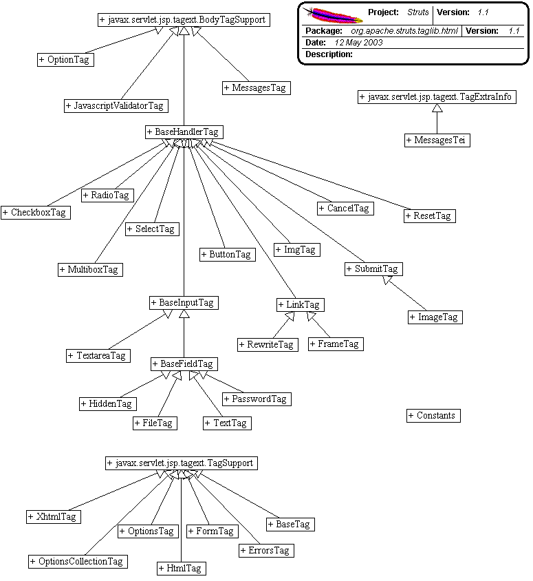

------------------------------------------------------------------------

 

<table>
<colgroup>
<col width="50%" />
<col width="50%" />
</colgroup>
<tbody>
<tr class="odd">
<td align="left">
<table>
<tbody>
<tr class="odd">
<td align="left"><a href="../../../../../overview-summary.html.md"><strong>Overview</strong></a> </td>
<td align="left"> <strong>Package</strong> </td>
<td align="left">Class </td>
<td align="left"><a href="package-use.html.md"><strong>Use</strong></a> </td>
<td align="left"><a href="package-tree.html.md"><strong>Tree</strong></a> </td>
<td align="left"><a href="../../../../../deprecated-list.html.md"><strong>Deprecated</strong></a> </td>
<td align="left"><a href="../../../../../index-all.html.md"><strong>Index</strong></a> </td>
<td align="left"><a href="../../../../../help-doc.html.md"><strong>Help</strong></a> </td>
</tr>
</tbody>
</table></td>
<td align="left"></td>
</tr>
<tr class="even">
<td align="left"> <a href="../../../../../org/apache/struts/taglib/bean/package-summary.html.md"><strong>PREV PACKAGE</strong></a>   <a href="../../../../../org/apache/struts/taglib/logic/package-summary.html"><strong>NEXT PACKAGE</strong></a></td>
<td align="left"><a href="../../../../../index.html.md?org/apache/struts/taglib/html/package-summary.html"><strong>FRAMES</strong></a>    <a href="package-summary.html"><strong>NO FRAMES</strong></a>    
<a href="../../../../../allclasses-noframe.html.md"><strong>All Classes</strong></a></td>
</tr>
</tbody>
</table>

------------------------------------------------------------------------

Package org.apache.struts.taglib.html.md
-------------------------------------

The "struts.html.md" tag library contains JSP custom tags useful in creating dynamic HTML user interfaces, including input forms.

**See:**
           [**Description**](#package_description)

**Class Summary**

**[BaseFieldTag](../../../../../org/apache/struts/taglib.html.md/BaseFieldTag.html "class in org.apache.struts.taglib.html")**

Convenience base class for the various input tags for text fields.

**[BaseHandlerTag](../../../../../org/apache/struts/taglib.html.md/BaseHandlerTag.html "class in org.apache.struts.taglib.html")**

Base class for tags that render form elements capable of including JavaScript event handlers and/or CSS Style attributes.

**[BaseInputTag](../../../../../org/apache/struts/taglib.html.md/BaseInputTag.html "class in org.apache.struts.taglib.html")**

Abstract base class for the various input tags.

**[BaseTag](../../../../../org/apache/struts/taglib.html.md/BaseTag.html "class in org.apache.struts.taglib.html")**

Renders an HTML element with an href attribute pointing to the absolute location of the enclosing JSP page.

**[ButtonTag](../../../../../org/apache/struts/taglib.html.md/ButtonTag.html "class in org.apache.struts.taglib.html")**

Renders an HTML BUTTON tag within the Struts framework.

**[CancelTag](../../../../../org/apache/struts/taglib.html.md/CancelTag.html "class in org.apache.struts.taglib.html")**

Tag for input fields of type "cancel".

**[CheckboxTag](../../../../../org/apache/struts/taglib.html.md/CheckboxTag.html "class in org.apache.struts.taglib.html")**

Tag for input fields of type "checkbox".

**[Constants](../../../../../org/apache/struts/taglib.html.md/Constants.html "class in org.apache.struts.taglib.html")**

Manifest constants for this package.

**[ErrorsTag](../../../../../org/apache/struts/taglib.html.md/ErrorsTag.html "class in org.apache.struts.taglib.html")**

Custom tag that renders error messages if an appropriate request attribute has been created.

**[FileTag](../../../../../org/apache/struts/taglib.html.md/FileTag.html "class in org.apache.struts.taglib.html")**

Custom tag for input fields of type "file".

**[FormTag](../../../../../org/apache/struts/taglib.html.md/FormTag.html "class in org.apache.struts.taglib.html")**

Custom tag that represents an input form, associated with a bean whose properties correspond to the various fields of the form.

**[FrameTag](../../../../../org/apache/struts/taglib.html.md/FrameTag.html "class in org.apache.struts.taglib.html")**

Generate an HTML `<frame>` tag with similar capabilities as those the `.html.md:link>` tag provides for hyperlink elements.

**[HiddenTag](../../../../../org/apache/struts/taglib.html.md/HiddenTag.html "class in org.apache.struts.taglib.html")**

Custom tag for input fields of type "hidden".

**[HtmlTag](../../../../../org/apache/struts/taglib.html.md/HtmlTag.html "class in org.apache.struts.taglib.html")**

Renders an HTML element with appropriate language attributes if there is a current Locale available in the user's session.

**[ImageTag](../../../../../org/apache/struts/taglib.html.md/ImageTag.html "class in org.apache.struts.taglib.html")**

Tag for input fields of type "image".

**[ImgTag](../../../../../org/apache/struts/taglib.html.md/ImgTag.html "class in org.apache.struts.taglib.html")**

Generate an IMG tag to the specified image URI.

**[JavascriptValidatorTag](../../../../../org/apache/struts/taglib.html.md/JavascriptValidatorTag.html "class in org.apache.struts.taglib.html")**

Custom tag that generates JavaScript for client side validation based on the validation rules loaded by the `ValidatorPlugIn` defined in the struts-config.xml file.

**[LinkTag](../../../../../org/apache/struts/taglib.html.md/LinkTag.html "class in org.apache.struts.taglib.html")**

Generate a URL-encoded hyperlink to the specified URI.

**[MessagesTag](../../../../../org/apache/struts/taglib.html.md/MessagesTag.html "class in org.apache.struts.taglib.html")**

Custom tag that iterates the elements of a message collection.

**[MessagesTei](../../../../../org/apache/struts/taglib.html.md/MessagesTei.html "class in org.apache.struts.taglib.html")**

Implementation of `TagExtraInfo` for the **messages** tag, identifying the scripting object(s) to be made visible.

**[MultiboxTag](../../../../../org/apache/struts/taglib.html.md/MultiboxTag.html "class in org.apache.struts.taglib.html")**

Tag for input fields of type "checkbox".

**[OptionsCollectionTag](../../../../../org/apache/struts/taglib.html.md/OptionsCollectionTag.html "class in org.apache.struts.taglib.html")**

Tag for creating multiple \<select\> options from a collection.

**[OptionsTag](../../../../../org/apache/struts/taglib.html.md/OptionsTag.html "class in org.apache.struts.taglib.html")**

Tag for creating multiple \<select\> options from a collection.

**[OptionTag](../../../../../org/apache/struts/taglib.html.md/OptionTag.html "class in org.apache.struts.taglib.html")**

Tag for select options.

**[ParamTag](../../../../../org/apache/struts/taglib.html.md/ParamTag.html "class in org.apache.struts.taglib.html")**

Adds a new request parameter to its parent [`LinkTag`](../../../../../org/apache/struts/taglib.html.md/LinkTag.html "class in org.apache.struts.taglib.html").

**[PasswordTag](../../../../../org/apache/struts/taglib.html.md/PasswordTag.html "class in org.apache.struts.taglib.html")**

Custom tag for input fields of type "password".

**[RadioTag](../../../../../org/apache/struts/taglib.html.md/RadioTag.html "class in org.apache.struts.taglib.html")**

Tag for input fields of type "radio".

**[ResetTag](../../../../../org/apache/struts/taglib.html.md/ResetTag.html "class in org.apache.struts.taglib.html")**

Tag for input fields of type "reset".

**[RewriteTag](../../../../../org/apache/struts/taglib.html.md/RewriteTag.html "class in org.apache.struts.taglib.html")**

Generate a URL-encoded URI as a string.

**[SelectTag](../../../../../org/apache/struts/taglib.html.md/SelectTag.html "class in org.apache.struts.taglib.html")**

Custom tag that represents an HTML select element, associated with a bean property specified by our attributes.

**[SubmitTag](../../../../../org/apache/struts/taglib.html.md/SubmitTag.html "class in org.apache.struts.taglib.html")**

Tag for input fields of type "submit".

**[TextareaTag](../../../../../org/apache/struts/taglib.html.md/TextareaTag.html "class in org.apache.struts.taglib.html")**

Custom tag for input fields of type "textarea".

**[TextTag](../../../../../org/apache/struts/taglib.html.md/TextTag.html "class in org.apache.struts.taglib.html")**

Custom tag for input fields of type "text".

**[.html.mdTag](../../../../../org/apache/struts/taglib/html/XhtmlTag.html "class in org.apache.struts.taglib.html")**

This tag tells all other.html.md taglib tags to render themselves in xhtml.

 

Package org.apache.struts.taglib.html.md Description
-------------------------------------------------

The "struts.html.md" tag library contains JSP custom tags useful in creating dynamic HTML user interfaces, including input forms.

[[Introduction]](#doc.Intro) [[HTML Form Tags]](#doc.Form) [[Other HTML Tags]](#doc.Other)

------------------------------------------------------------------------

### Introduction

The tags in the Struts HTML library form a bridge between a JSP view and the other components of a Web application. Since a dynamic Web application often depends on gathering data from a user, input forms play an important role in the Struts framework. Consequently, the majority of the HTML tags involve [HTML](#doc.Form) forms. Other important issues addressed by the Struts-HTML tags are [messages](#doc.Other.messages) , [error messages](#doc.Other.errors) , [hyperlinking](#doc.Other.hyperlinking) and [internationalization](#doc.Other.i18n) .

------------------------------------------------------------------------

### HTML "form" tags

-   [button](../../../../../../tagreference.html.md#button)
-   [cancel](../../../../../../tagreference.html.md#cancel)
-   [checkboxes](../../../../../../tagreference.html.md#checkbox)
-   [file](../../../../../../tagreference.html.md#file)
-   [hidden](../../../../../../tagreference.html.md#hidden)
-   [image](../../../../../../tagreference.html.md#image)
-   [multibox](../../../../../../tagreference.html.md#multibox)
-   [password](../../../../../../tagreference.html.md#password) input fields
-   [radio](../../../../../../tagreference.html.md#radio) buttons
-   [reset](../../../../../../tagreference.html.md#reset) buttons
-   [select](../../../../../../tagreference.html.md#select) lists with embedded
-   [option](../../../../../../tagreference.html.md#option)
-   [options](../../../../../../tagreference.html.md#options)
-   [submit](../../../../../../tagreference.html.md#submit) buttons
-   [text](../../../../../../tagreference.html.md#text) input fields
-   [textareas](../../../../../../tagreference.html.md#textarea)

Each of these tags must be nested within a \.html.md:form\> tag.

#### About the form tag

The Struts `form` tag outputs a standard HTML form tag, and also links the input form with a JavaBean subclassed from the Struts [ActionForm](../../action/ActionForm.html.md)object. Each field in the form should correspond to a property of the form's bean. When a field and property correspond, the bean is first used to populate the form, and then to store the user's input when the form is submitted to the controller servlet.

The name of the bean and its class can be specified as a property to the form tag, but may also be omitted. If omitted, the `ActionMappings` database (loaded from the `struts-config.xml` file) is consulted. If the current page is specified as the `input` property for an `action`, the name of the `action` is used. The `type` property for the bean is also then taken from the configuration, via a Form Bean definition.

Here's a clip from the Struts Example configuration:

    <action-mappings>
     <!-- Process a user logon -->
     <action
        path="/logon"
     type="org.apache.struts.webapp.example.LogonAction"
        name="logonForm"
     scope="request"
     input="/logon.jsp">
     </action>
        
     < ... />
    </action-mappings>
    <form-beans>
        <!-- Logon form bean -->
     <form-bean name="logonForm"
        type="org.apache.struts.webapp.example.LogonForm"/>
     < ... />
        
     </form-beans>
    </pre>

Given this configuration, the HTML form tag for `logon.jsp` will default to using "`logonForm`" as its name property and " `org.apache.struts.webapp.example.LogonForm`" as the attribute's type. This way you can manage the namespace for your framework components from the configuration file.

If the form tag does not find the form bean in any of the scopes (page, request, session, application), it creates one using the specified type.

The Struts `ActionForm` class is equipped with standard `reset()` and `validate()` methods, that can be used by the controller to enable automatic data validation. See the [Users Guide](../../../../../../userGuide/building_view.html.md#form_validation) for more about Form Validation. An important aspect of validation is reporting errors to the user. This can be handled by the Struts `errors` tag, which is discussed [later in this document](#doc.Other.errors) .

------------------------------------------------------------------------

#### Common Form Tag Attributes

The form "field" tags in the Struts-HTML tag library share a common set of tag attributes that have the same meaning, no matter what field tag they are used with. These properties also accept Runtime Expressions, meaning you can set them with a scriptlet. The common attributes fall into four categories: [Struts Common,](#doc.Form.attributes.struts) [HTML Navigation](#doc.Form.attributes.navigation) , [Javascript](#doc.Form.attributes.javascript) , and [CSS](#doc.Form.attributes.css) .

##### Struts Common

|----------|----------------------------------------------------------------------------------------------------------------------------------------------------------------------------------------------------------------------------|
| name     | The attribute name of the `ActionForm` bean whose properties are consulted when rendering the current value of this input field. If not specified, the bean associated with the form tag we are nested within is utilized. |
| property | Name of the request parameter that will be included with this submission, set to the specified value.                                                                                                                      |
| value    | Value of the label to be used with this element. This value will also be submitted as the value of the specified request parameter. [Body of this tag (if any), or "Click"]                                                |

 

Like [Struts-Bean](../bean/package-summary.html.md#doc.Properties) tags, the property attribute for the Struts-HTML tags accept simple, nested, and indexed expressions. For example, this tag:

      .html.md:text property="mailingAddress.street"/>

corresponds to:

     getMailingAddress().getStreet()

For more about using simple, nested, and indexed expressions with Struts, see the [Struts-Bean Developers Guide.](../bean/package-summary.html.md#doc.Properties)

##### Javascript Event Handlers

|-------------|---------------------------------------------------------------------------------------------------------|
| onblur      | Executed when this element loses input focus.                                                           |
| onchange    | Executed when this element loses input focus and its value has changed.                                 |
| onclick     | Executed when this element receives a mouse click.                                                      |
| ondblclick  | Executed when this element receives a mouse - double click.                                             |
| onfocus     | Executed when this element receives input focus.                                                        |
| onkeydown   | Executed when this element has focus and a key is depressed.                                            |
| onkeypress  | Executed when this element has focus and a key is depressed and released                                |
| onkeyup     | Executed when this element has focus and a key is released                                              |
| onmousedown | Executed when this element is under the mouse pointer and a mouse button is depressed.                  |
| onmousemove | Executed when this element is under the mouse pointer and the pointer is moved.                         |
| onmouseout  | Executed when this element was under the mouse pointer but the pointer was moved outside the element.   |
| onmouseover | Executed when this element was not under the mouse pointer but the pointer is moved inside the element. |
| onmouseup   | Executed when this element is under the mouse pointer and a mouse button is released.                   |
|             | **"parent" form tag only**                                                                              |
| onreset     | Executed if the form is reset.                                                                          |
| onsubmit    | Executed if the form is submitted.                                                                      |

#####  

##### HTML Navigation Attributes

|-----------|------------------------------------------------------------------------|
| accesskey | The keyboard character used to move focus immediately to this element. |
| tabindex  | The tab order (ascending positive integers) for this element.          |

#####  

##### CSS Attributes

|------------|----------------------------------------------------------|
| style      | CSS styles to be applied to this HTML element.           |
| styleClass | CSS stylesheet class to be applied to this HTML element. |

 

See the [HTML Tags Reference](../../../../../../tagreference.html.md) for detailed information about the available tags in this tag library, and the complete list of valid attributes for each tag.

------------------------------------------------------------------------

### Other HTML tags

Aside from form processing, the Struts-HTML offers several other tags or tag properties to help with displaying error messages, messages, maintaining hyperlinks, and with internationalizing your application.

#### Displaying Messages

Message handling is an important part of any application. These messages can be informative messages and/or error messages for the user. Struts provides a generalized method for communicating runtime messages to users, based on the same technology used to provide internationalization. Messages and error messages can both be used by the messages tag.

The messages tag [since version 1.1] has basically the same functionality as the errors tag, but it iterates through the messages so any formatting of messages can be done in the JSP page. Also the header and footer for the message tag are optional.

By default, the messages tag will iterate through all pending messages. You can also specify a property when queuing a message, and then refer to that property in the messages tag. In that case, only the message(s) for that property will be displayed. This is helpful when you would like to place the message for a field next to the actual field.

Messages are often queued in the Action. The variable info is the ActionForm corresponding to this Action. :

     ActionMessages messages = new ActionMessages();
        messages.add(ActionMessages.GLOBAL_MESSAGE, new
        ActionMessage("userForm.insert", info.getUserName());
        messages.add("activationDate", new ActionMessage("userForm.active",
        info.getSubscriptionLength());

This queues two messages, one is a global message and another for the "activationDate" field. To print all the messages together, simply place the messages tag anywhere in your JSP.

      <body bgcolor="white">
     <ul>
     .html.md:messages
        id="message">
     <li><bean:write name="message"/></li>
        
     <.html.md:messages>
     </ul>

Or, you can place specific messages at different locations

      <ul>
     .html.md:messages id="message" property="<%=
        org.apache.struts.action.ActionMessages.GLOBAL_MESSAGE %>">
     <li><bean:write
        name="message"/></li>
     <.html.md:messages>
     </ul>
        
     <table>
     <tr>
     <td align="left">
     .html.md:text
        property="username" size="16" maxlength="16"/>
     </td>
     </tr>
        
     <tr>
     <td align="left">
     .html.md:text
        property="activationDate" size="10" maxlength="10"/>
      
        .html.md:messages id="message" property="activationDate">
     <bean:write
        name="message"/> 
     <.html.md:messages>
     </td>
        
     </tr>
     </table>

By default, the actual message is retrieved from the application's standard message resource. This gives you a master list of the messages used by your application, and provides for internationalization. In the code snippet, the message corresponding to "userForm.insert" would be retrieved and displayed to the user at runtime.

     userForm.insert={0} has successfully been inserted.
        userForm.active=The account will be active for {0} months.

A header and footer are optional. The header will be rendered before iteration begins and the footer will be rendered after iteration is over. If a value is not assigned to the attribute, then nothing will be rendered for that attribute.

      .html.md:messages id="message" header="errors.header"
        footer="errors.footer">
     <li><bean:write name="message"/></li>
        
     <.html.md:messages>

     errors.header=<h3>Validation Error</h3>
     You must
        correct the following error(s) before proceeding:<UL>
        errors.footer=</ul>

#### Displaying Error Messages

Error handling is an important part of any application, and curing an error often involves getting the user's help. Struts provides a generalized method for communicating runtime messages to users, based on the same technology used to provide internationalization.

In a Web application, it is common to reuse the input page to display error messages. The Struts error message tag can be placed wherever you would like the messages to display. If no messages are pending, nothing is printed.

By default, the errors tag will print all pending messages. You can also specify a property when queuing a message, and then refer to that property in the errors tag. In that case, only the message for that property will be displayed. This is helpful when you would like to place the message for a field next to the actual field.

Error messages are often queued in the ActionForm validate method. Here's a snippet from the Struts Example application:

     ActionErrors errors = new ActionErrors();
     if ((username == null) ||
        (username.length() < 1))
     errors.add("username", new
        ActionMessage("error.username.required"));
     if ((password == null) ||
        (password.length() < 1))
     errors.add("password",
     new
        ActionMessage("error.password.required"));

This queues two error messages, one for the "username" field and another for the "password" field. To print all the messages together, simply place the error tag anywhere in your JSP.

      <body bgcolor="white">
     .html.md:errors/>

Or, you can place specific error messages at different locations

      <td align="left">
     .html.md:text property="username" size="16"
        maxlength="16"/>
     .html.md:errors property="username"/>
     </td>
        
     </tr><tr>
     <td align="left">
     .html.md:text
        property="password" size="16" maxlength="16"/>
     .html.md:errors
        property="password"/>
     </td>

By default, the actual error message is retrieved from the application's standard message resource. This gives you a master list of the error messages used by your application, and provides for internationalization. In the code snippet, the message corresponding to "error.username.required" would be retrieved and displayed to the user at runtime.

     error.username.required=<li>Username is required</li>

Most often, error messages are displayed in a particular way. To make it easy to format your messages, you can also specific an `errors.header` and `errors.footer` string in your message resource. Typically, you might want to render the messages in a different color, or set them up to appear in an unordered list. Using the `errors.header` and `errors.footer` strings keeps the setup codes out of your JSP until a message actually prints.

     errors.header=<h3>Validation Error</h3>
        
     You must correct the following error(s) before proceeding:<UL>
        
     errors.footer=</ul>

#### Maintaining Hyperlinks

-   [base](../../../../../../tagreference.html.md#base)

When implementing a Web application, it is usually a good idea to use relative references to other files in the same application. But in a dynamic application, the controller servlet often returns a completely different file than the one requested. (Often, the requested "file" doesn't actually exist, but represents an action for the controller to interpret.) Since relative references are resolved by the browser, they often won't work in a dynamic application.

To accommodate this, the Struts-HTML taglib provides a `<base>` tag that renders an HTML element with an href attribute pointing to the absolute location of its page.

As a rule, you should place the Struts-HTML base tag in the \<head\> section of any JSP that uses relative references to other files.

      <head>
     .html.md:base/>
     </head>

#### Session Tracking

The Java Servlet framework has built-in support for tracking a client through a session. Sessions are a useful way to compensate for the stateless nature of HTTP. Tracking a client can be done with either cookies or URL rewriting, cookies being preferred when available. Struts offers three tags that make it easy to write "session-aware" hyperlink references:

-   [link](../../../../../../tagreference.html.md#link) - Renders an HTML anchor or hyperlink.
-   [rewrite](../../../../../../tagreference.html.md#rewrite) - Renders a request URI, but without creating the \<a\> hyperlink. This tag is useful when you want to generate a string constant for use by a JavaScript procedure.
-   [img](../../../../../../tagreference.html.md#img) - Renders an HTML \ element with the image at the specified URL.

Each of these tags will automatically apply URL rewriting, to maintain session state in the absence of cookies. The content displayed for the hyperlink will be taken from the body of the tag. The base URL for the hyperlink is calculated based on properties given with the tag.

Normally, the hyperlink or URI you specify is left unchanged. If you would like to include dynamic parameters to the hyperlink or URI, you can pass those to the tags via a JavaBean. If there may be naming conflicts, you can also specify the scope that the tag searches (request, page, session, application).

To pass a single dynamic parameter, specify the parameter's name using the `paramId` attribute. You can then specify the name of the JavaBean holding the value using the `paramName` attribute, and a particular property using `paramProperty`.

So, a tag like

       .html.md:link paramId="target"
     paramName="linkParams" 
        paramProperty="target"
     paramScope="request"
     >detail.html.md</html:link>

would correspond to something like

      <A HREF="detail.html.md?<%= 
        request.getAttribute("linkParams").getTarget()
     %>"></A>
        

To search all scopes (request, page, session, and application), omit `paramScope`.

The `paramProperty` attribute may also be omitted, so long as the named bean identifies a value that can be converted to a String.

To pass multiple dynamic parameters, you can store them in a `java.util.Map` , and use the name of the map for the `paramName`. The map must then contain one or more `paramIds` and their corresponding values. As the Map is processed, the keys are assumed to be the names of query parameters to be appended. The value associated with each key must be either a String or a String array representing the parameter value(s). If a String array is specified, more than one value for the same query parameter name will be created.

The HTML session tracking tags use several common attributes, that can be organized into three groups, as follows. All of these attributes are not used by all three tags (`link`, `rewrite`, and `img`), and so the tags using each attribute is given.

 

forward, href, and page

forward

[ link rewrite ] - Logical name of a global ActionForward that contains the actual content-relative URI of the destination of this transfer. This hyperlink may be dynamically modified by the inclusion of query parameters, as described in the tag description. You must specify exactly one of the forward attribute, the href attribute, the linkName attribute, or the page attribute

href

[ link rewrite ] - The URL to which this hyperlink will transfer control if activated. This hyperlink may be dynamically modified by the inclusion of query parameters, as described in the tag description. You must specify exactly one of the forward attribute, the href attribute, the linkName attribute, or the page attribute.

page

[ link rewrite ] - The context-relative path, starting with a slash, of the image to be displayed by this tag. The rendered URL for this image will automatically prepend the context path of this web application (in the same manner as the page attribute on the link tag works), in addition to any necessary URL rewriting. You must specify either the page attribute or the src attribute.

 

linkName, Target , and src

linkName

[ link ] - The anchor name to be defined within this page, so that you can reference it with intra-page hyperlinks. In other words, the value specified here will render a "name" element in the generated anchor tag.

target

[ link img ] - The window target in which the resource requested by this hyperlink will be displayed, for example in a framed presentation.

src

[ img ] - The URL to which this image will be transferred from This image may be dynamically modified by the inclusion of query parameters, as described in the tag description. This value will be used unmodified (other than potential URL rewriting) as the value of the "src" attribute in the rendered tag. You must specify either the page attribute or the the src attribute.

 

paramId, paramName, paramProperty, paramScope

paramId

[ link img ] - The name of the request parameter that will be dynamically added to the generated src URL. The corresponding value is defined by the paramName and (optional) paramProperty attributes, optionally scoped by the paramScope attribute

paramName

[ link img ] - The name of a JSP bean that is a String containing the value for the request parameter named by paramId (if paramProperty is not specified), or a JSP bean whose property getter is called to return a String (if paramProperty is specified). The JSP bean is constrained to the bean scope specified by the paramScope property, if it is specified.

paramProperty

[ link img ] - The name of a property of the bean specified by the paramName attribute, whose return value must be a String containing the value of the request parameter (named by the paramId attribute) that will be dynamically added to this hyperlink or src URL

paramScope

[ link img ] - The scope within which to search for the bean specified by the paramName attribute. If not specified, all scopes are searched.

 

name, property, scope

name

[ link rewrite img ] - The name of a JSP bean that contains a `Map` representing the query parameters (if `property` is not specified), or a JSP bean whose property getter is called to return a `Map` (if `property` is specified).

property

[ link rewrite img ] - The name of a property of the bean specified by the name attribute, whose return value must be a `Map` containing the query parameters to be added to the src URL. You **must** specify the name attribute if you specify this attribute

scope

[ link rewrite img ] - The scope within which to search for the bean specified by the name attribute. If not specified, all scopes are searched.

See the [HTML Tags Reference](../../../../../../tagreference.html.md) for the complete list of valid attributes for each tag..

#### Internationalization

Internationalization is automatically supported by the HTML tags where appropriate.

[Errors](../../../../../../tagreference.html.md#errors) - By default, the text for your messages will be returned by the default message resource, which will select the appropriate language for the user. You may also specify another message resource using the `bundle` attribute.

[HTML](../../../../../../tagreference.html.md#html) - Renders an HTML element with language attributes extracted from the user's current Locale object, if there is one.

[image](../../../../../../tagreference.html.md#image) and [img](../../../../../../tagreference.html#img) - Can optionally retrieve the value for its binary source and alt text from the message resource, so that different images and/or text can be provided for different locales. See the tag's `altKey`, `srcKey` , and `bundle` attributes in the [HTML Tags Reference](../../../../../../tagreference.html) .

[Messages](../../../../../../tagreference.html.md#messages) - By default, the text for your messages will be returned by the default message resource, which will select the appropriate language for the user. You may also specify another message resource using the `bundle` attribute.

See the [Users Guide](../../../../../../userGuide/building_view.html.md#i18n) for more on how Struts helps you internationalize your applications.

 

------------------------------------------------------------------------

 

<table>
<colgroup>
<col width="50%" />
<col width="50%" />
</colgroup>
<tbody>
<tr class="odd">
<td align="left">
<table>
<tbody>
<tr class="odd">
<td align="left"><a href="../../../../../overview-summary.html.md"><strong>Overview</strong></a> </td>
<td align="left"> <strong>Package</strong> </td>
<td align="left">Class </td>
<td align="left"><a href="package-use.html.md"><strong>Use</strong></a> </td>
<td align="left"><a href="package-tree.html.md"><strong>Tree</strong></a> </td>
<td align="left"><a href="../../../../../deprecated-list.html.md"><strong>Deprecated</strong></a> </td>
<td align="left"><a href="../../../../../index-all.html.md"><strong>Index</strong></a> </td>
<td align="left"><a href="../../../../../help-doc.html.md"><strong>Help</strong></a> </td>
</tr>
</tbody>
</table></td>
<td align="left"></td>
</tr>
<tr class="even">
<td align="left"> <a href="../../../../../org/apache/struts/taglib/bean/package-summary.html.md"><strong>PREV PACKAGE</strong></a>   <a href="../../../../../org/apache/struts/taglib/logic/package-summary.html"><strong>NEXT PACKAGE</strong></a></td>
<td align="left"><a href="../../../../../index.html.md?org/apache/struts/taglib/html/package-summary.html"><strong>FRAMES</strong></a>    <a href="package-summary.html"><strong>NO FRAMES</strong></a>    
<a href="../../../../../allclasses-noframe.html.md"><strong>All Classes</strong></a></td>
</tr>
</tbody>
</table>

------------------------------------------------------------------------

Copyright © 2000-2008 [Apache Software Foundation](http://www.apache.org/). All Rights Reserved.
