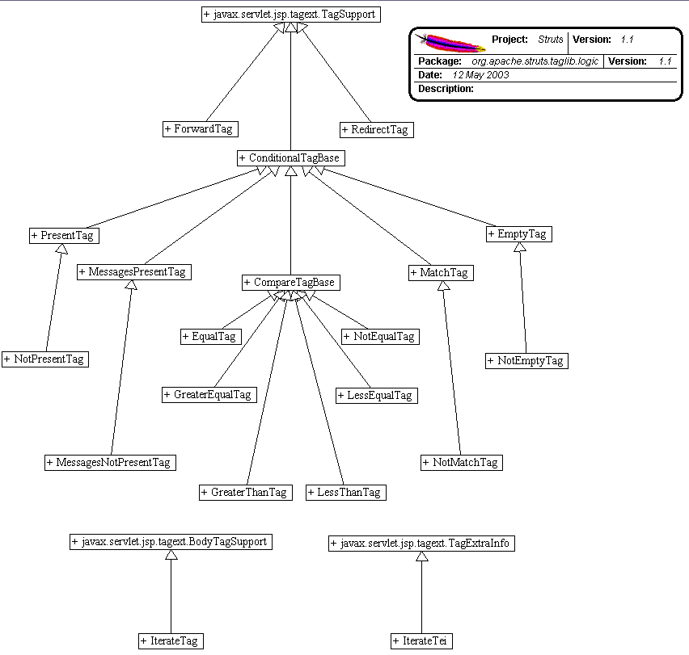

------------------------------------------------------------------------

 

<table>
<colgroup>
<col width="50%" />
<col width="50%" />
</colgroup>
<tbody>
<tr class="odd">
<td align="left">
<table>
<tbody>
<tr class="odd">
<td align="left"><a href="../../../../../overview-summary.html.md"><strong>Overview</strong></a> </td>
<td align="left"> <strong>Package</strong> </td>
<td align="left">Class </td>
<td align="left"><a href="package-use.html.md"><strong>Use</strong></a> </td>
<td align="left"><a href="package-tree.html.md"><strong>Tree</strong></a> </td>
<td align="left"><a href="../../../../../deprecated-list.html.md"><strong>Deprecated</strong></a> </td>
<td align="left"><a href="../../../../../index-all.html.md"><strong>Index</strong></a> </td>
<td align="left"><a href="../../../../../help-doc.html.md"><strong>Help</strong></a> </td>
</tr>
</tbody>
</table></td>
<td align="left"></td>
</tr>
<tr class="even">
<td align="left"> <a href="../../../../../org/apache/struts/taglib.html.md/package-summary.html"><strong>PREV PACKAGE</strong></a>   <a href="../../../../../org/apache/struts/taglib/nested/package-summary.html"><strong>NEXT PACKAGE</strong></a></td>
<td align="left"><a href="../../../../../index.html.md?org/apache/struts/taglib/logic/package-summary.html"><strong>FRAMES</strong></a>    <a href="package-summary.html"><strong>NO FRAMES</strong></a>    
<a href="../../../../../allclasses-noframe.html.md"><strong>All Classes</strong></a></td>
</tr>
</tbody>
</table>

------------------------------------------------------------------------

Package org.apache.struts.taglib.logic
--------------------------------------

The "struts-logic" tag library contains tags that are useful in managing conditional generation of output text, looping over object collections for repetitive generation of output text, and application flow management.

**See:**
           [**Description**](#package_description)

**Class Summary**

**[CompareTagBase](../../../../../org/apache/struts/taglib/logic/CompareTagBase.html.md "class in org.apache.struts.taglib.logic")**

Abstract base class for comparison tags.

**[ConditionalTagBase](../../../../../org/apache/struts/taglib/logic/ConditionalTagBase.html.md "class in org.apache.struts.taglib.logic")**

Abstract base class for the various conditional evaluation tags.

**[EmptyTag](../../../../../org/apache/struts/taglib/logic/EmptyTag.html.md "class in org.apache.struts.taglib.logic")**

Evalute the nested body content of this tag if the specified value is empty for this request.

**[EqualTag](../../../../../org/apache/struts/taglib/logic/EqualTag.html.md "class in org.apache.struts.taglib.logic")**

Evaluate the nested body content of this tag if the specified variable and value are equal.

**[ForwardTag](../../../../../org/apache/struts/taglib/logic/ForwardTag.html.md "class in org.apache.struts.taglib.logic")**

Perform a forward or redirect to a page that is looked up in the configuration information associated with our application.

**[GreaterEqualTag](../../../../../org/apache/struts/taglib/logic/GreaterEqualTag.html.md "class in org.apache.struts.taglib.logic")**

Evaluate the nested body content of this tag if the specified variable is greater than or equal to the specified value.

**[GreaterThanTag](../../../../../org/apache/struts/taglib/logic/GreaterThanTag.html.md "class in org.apache.struts.taglib.logic")**

Evaluate the nested body content of this tag if the specified variable is greater than the specified value.

**[IterateTag](../../../../../org/apache/struts/taglib/logic/IterateTag.html.md "class in org.apache.struts.taglib.logic")**

Custom tag that iterates the elements of a collection, which can be either an attribute or the property of an attribute.

**[IterateTei](../../../../../org/apache/struts/taglib/logic/IterateTei.html.md "class in org.apache.struts.taglib.logic")**

Implementation of `TagExtraInfo` for the **iterate** tag, identifying the scripting object(s) to be made visible.

**[LessEqualTag](../../../../../org/apache/struts/taglib/logic/LessEqualTag.html.md "class in org.apache.struts.taglib.logic")**

Evaluate the nested body content of this tag if the specified variable is less than or equal to the specified value.

**[LessThanTag](../../../../../org/apache/struts/taglib/logic/LessThanTag.html.md "class in org.apache.struts.taglib.logic")**

Evaluate the nested body content of this tag if the specified variable is less than the specified value.

**[MatchTag](../../../../../org/apache/struts/taglib/logic/MatchTag.html.md "class in org.apache.struts.taglib.logic")**

Evalute the nested body content of this tag if the specified value is a substring of the specified variable.

**[MessagesNotPresentTag](../../../../../org/apache/struts/taglib/logic/MessagesNotPresentTag.html.md "class in org.apache.struts.taglib.logic")**

Evalute the nested body content of this tag if the specified value is not present for this request.

**[MessagesPresentTag](../../../../../org/apache/struts/taglib/logic/MessagesPresentTag.html.md "class in org.apache.struts.taglib.logic")**

Evalute to `true` if an `ActionMessages` class or a class that can be converted to an `ActionMessages` class is in request scope under the specified key and there is at least one message in the class or for the property specified.

**[NotEmptyTag](../../../../../org/apache/struts/taglib/logic/NotEmptyTag.html.md "class in org.apache.struts.taglib.logic")**

Evalute the nested body content of this tag if the specified value is not empty for this request.

**[NotEqualTag](../../../../../org/apache/struts/taglib/logic/NotEqualTag.html.md "class in org.apache.struts.taglib.logic")**

Evaluate the nested body content of this tag if the specified variable and value are not equal.

**[NotMatchTag](../../../../../org/apache/struts/taglib/logic/NotMatchTag.html.md "class in org.apache.struts.taglib.logic")**

Evalute the nested body content of this tag if the specified value is not a substring of the specified variable.

**[NotPresentTag](../../../../../org/apache/struts/taglib/logic/NotPresentTag.html.md "class in org.apache.struts.taglib.logic")**

Evalute the nested body content of this tag if the specified value is not present for this request.

**[PresentTag](../../../../../org/apache/struts/taglib/logic/PresentTag.html.md "class in org.apache.struts.taglib.logic")**

Evalute the nested body content of this tag if the specified value is present for this request.

**[RedirectTag](../../../../../org/apache/struts/taglib/logic/RedirectTag.html.md "class in org.apache.struts.taglib.logic")**

Generate a URL-encoded redirect to the specified URI.

 

Package org.apache.struts.taglib.logic Description
--------------------------------------------------

The "struts-logic" tag library contains tags that are useful in managing conditional generation of output text, looping over object collections for repetitive generation of output text, and application flow management.

[[Introduction]](#doc.Introduction) [[Logic Functionality]](#doc.Functionality) [[Logic Properties]](#doc.Properties) [[Logic Examples]](#doc.Examples)

------------------------------------------------------------------------

### Introduction

The Logic library supplies tags that are useful for manipulating presentation logic without the use of scriptlets.

### Logic Tag Functionality

The functionality of the logic tags can be divided into four groups:

**Value Comparisons -** The purpose of these tags is to print out the body of the tag if the comparison evaluates to *true.*

-   **[equal,](../../../../../../tagreference.html.md#equal) [notEqual](../../../../../../tagreference.html#notEqual)**
-   **[greaterEqual](../../../../../../tagreference.html.md#greaterEqual) , [lessEqual](../../../../../../tagreference.html#lessEqual)**
-   **[greaterThan](../../../../../../tagreference.html.md#greaterThan) , [lessThan](../../../../../../tagreference.html#lessThan)**

**Substring Matching -** The purpose of these tags is to match substrings inside of other Strings

-   **[match](../../../../../../tagreference.html.md#match) , [notMatch](../../../../../../tagreference.html#notMatch)**

**Presentation Location -** The purpose of these tags is to change the location of the presentation page

-   [**forward**](../../../../../../tagreference.html.md#forward)
-   [**redirect**](../../../../../../tagreference.html.md#redirect)

**Collection Utilities -**The purpose of these tags is to handle Collections

-   [**iterate**](../../../../../../tagreference.html.md#iterate)

### Logic Tag Properties

Each of the four groups of logic tags have a common set of attributes associated with them. :

> **Value Comparisons** (equal, notEqual, greaterEqual, lessEqual, greaterThan, lessThan, present, notPresent)
>
> Each of the value comparison tags takes a *value* and compares it to the value of a comparison attribute. If the value given can be successfully converted to a *float* or *double*, then a number comparison is performed on the value given and the value of the comparison attribute. Otherwise a String comparison is performed. You have to specify one of the comparison attributes: *cookie*, *header*, *parameter* , *property* or *name.* For each of the examples, the tag " *someComparisonTag"*can be replaced by any of the value comparison tags.
>
> -   value - the value to which this tag is going to compare, used in conjunction with one of the comparison attributes: *cookie*, *header*, *parameter*, *and property* and/or *name.*
> -   cookie - the name of the cookie to compare to *value*
>     -   example:
>
>             <logic:someComparisonTag value="someUserName"
>                                 cookie="userName">
>              User Logged In
>             </logic:someComparisonTag>
>                                 
>
> -   header - the name of the HTTP header to compare to *value*
>     -   example:
>
>             <logic:someComparisonTag value="en_US"
>                                 header="Accept-Language">
>              Welcome English-speaking
>                                 User*
>             </logic:someComparisonTag>
>
>     -   \*Note: See the section in the user's guide on [Internationalized Messages](../../../../../../userGuide/building_view.html.md#i18n) to do things like this better.
>
> -   name - the variable to be compared to *value* is the JSP bean specified by this attribute, if property is not specified, or the value of the specified property of this bean, if property is specified.
>     -   example:
>
>             <%
>              String testString = "pantalones";
>                                 pageContext.setAttribute("testString", testString,
>                                 PageContext.PAGE_SCOPE);
>             %>
>             <jsp:useBean
>                                 id="testString" scope="page" type="java.lang.String" />
>                                 
>             <logic:someComparisonTag name="testString"
>                                 value="pantalones">
>              Usted tiene pantalones!
>             </logic:someComparison>
>                                 
>
> -   parameter - the name of the request parameter to compare to *value*
>     -   example:
>
>             <logic:someComparisonTag value=""
>                                 parameter="username">
>              Error: a username must be
>                                 specified
>             </logic:someComparisonTag>
>                             
>
> -   property - the variable to be compared with *value* is the property (of the bean specified by the name attribute) specified by this attribute. The property reference can be simple, nested, and/or indexed. *property* is used in conjunction with *name* to specify a property in the bean specified by *name*. For the type of syntax used for property, see the users guide on the Bean Tags.
> -   scope - the bean scope within which to search for the bean named by the name property, or "any scope" if not specified. Possible values are "page", "request", "session", "application", or "any scope"
>
> **Substring Matching** (match, notMatch)
>
> The substring matching tags take all the same arguments as the value comparison tags. You compare the String specified by *value* to any of the comparison values you give it, specified by *cookie*, *header*, *parameter*, *property* or *name.* Note that in the examples, *matchTag* corresponds either the *match* or *notMatch* tag. Matching tags also have an additional *location* attribute added:
>
> -   location - has two possible values, "start" and "end". If "start", the substring is attempted to be matched at the beginning of the String, if "end", then the substring is attempted to be matched to the end of the String
>     -   example:
>
>             <logic:matchTag parameter="action"
>                                 value="processLogin" location="start">
>              Processing
>                                 Login....
>             </logic:matchTag>
>
>             In this
>                                 example, a request parameter "action" was compared to see
>                                 if
>             its value started with the String "processLogin". In
>                                 this case,
>             matchTag would have to be <logic:match>.
>                                 
>
> **Presentation Location** (forward, redirect)
>
> The *redirect* tag is resposible for sending a re-direct to the client's browser, complete with URL-rewriting if it's supported by the container. Its attributes are consistent with the Struts HTML [`link`](../../../../../../userGuide/struts.html.md.html#link) tag. The base URL is calculated based on which of the following attributes you specify (you must specify exactly one of them):
>
> -   forward - Use the value of this attribute as the name of a global ActionForward to be looked up, and use the context-relative URI found there.
> -   href - Use the value of this attribute unchanged.
> -   page - Use the value of this attribute as a context-relative URI, and generate a server-relative URI by including the context path.
>
> The *forward* tag is responsible for either redirecting or forwarding to a specified global action forward. To define a global ActionForward, see The [Action Mappings Configuration File](../../../../../../userGuide/building_controller.html.md#config) . You can specify whether the forward re-directs or forwards when executed in the config file. The forward tag has one attribute:
>
> -   name - The logical name of the ActionForward to use
>
> **Collection Utilities** (iterate)
>
> The *iterate* tag is responsible for executing its body content once for every element inside of the specified Collection. There is one required attribute:
>
> -   id - The name of a page scope JSP bean that will contain the current element of the collection on each iteration
>
> The other attributes allow for more flexibility on which Collection to iterate and how to do it:
>
> -   collection - a runtime expression that evaluates to a Collection to be iterated
>     -   example:
>
>             <%
>              java.util.Vector vector = new
>                                 java.util.Vector();
>              vector.add(new Integer(12));
>                                 vector.add(new Integer(5));
>              %>
>
> > >     <logic:iterate id="myCollectionElement" collection="<%=
> > >                 vector %>">
> > >      Do something with myCollectionElement
> > >                 </logic:iterate>
> > >             
>
> -   length - The maximum number of entries (from the underlying collection) to be iterated through on this page. This can be either an integer that directly expresses the desired value, or the name of a JSP bean (in any scope) of type java.lang.Integer that defines the desired value. If not present, there will be no limit on the number of iterations performed
> -   name - The name of the JSP bean containing the collection to be iterated (if property is not specified), or the JSP bean whose property getter returns the collection to be iterated (if property is specified).
>     -   example:
>
>             <%
>                                 java.util.ArrayList list = new java.util.ArrayList();
>                                 list.add("First");
>                                 list.add("Second");
>                                 list.add("Third");
>                                 list.add("Fourth");
>                                 list.add("Fifth");
>                                 pageContext.setAttribute("list", list,
>                                 PageContext.PAGE_SCOPE);
>                                 %>
>
>                                 <logic:iterate id="myCollectionElement" name="list">
>                                 Do something with myCollectionElement
>                                 </logic:iterate>
>
> -   offset - The zero-relative index of the starting point at which entries from the underlying collection will be iterated through. This can be either an integer that directly expresses the desired value, or the name of a JSP bean (in any scope) of type java.lang.Integer that defines the desired value. If not present, zero is assumed (meaning that the collection will be iterated from the beginning.
> -   property - Name of the property, of the JSP bean specified by name, whose getter returns the collection to be iterated. See the user's guide for the bean tag library for the syntax of the property attribute
> -   scope - The bean scope within which to search for the bean named by the name property, or "any scope" if not specified. Possible values are "page", "request", "session", "application", or "any scope"
> -   type - Fully qualified Java class name of the element to be exposed through the JSP bean named from the id attribute. If not present, no type conversions will be performed. NOTE: The actual elements of the collection must be assignment-compatible with this class, or a request time ClassCastException will occur.
>     -   example:
>
>             <% java.util.ArrayList list = new
>                                 java.util.ArrayList();
>             list.add("First");
>                                 list.add("Second");
>             list.add("Third");
>                                 list.add("Fourth");
>             list.add("Fifth");
>                                 pageContext.setAttribute("list", list,
>                                 PageContext.PAGE_SCOPE);
>              %>
>
>             <logic:iterate
>                                 id="myCollectionElement" name="list"
>                                 type="java.lang.String">
>               Do something with
>                                 myCollectionElement
>                                 </logic:iterate>
>
### Logic Examples

> **Value Comparisons**
>
> > Logic Equivalence Tags (equal, notEqual, greaterEqual, lessEqual, lessThan, greaterThan)
> >
> > > You can compare these tags to the "==", "!=" ,"\>=", "\<=", "\<", and "\>"logic operators in most languages. Their usage is fairly straightforward for numbers. For an example, we'll create a small "Guess That Number" game that uses request parameters from a form input to play. The number will be hardcoded as "7", because this is just an example. Note that this is actually putting application logic inside of jsp pages, and isn't the recommended development method for Struts. It's just an easy way to show how these tags are used:
> > >
> > > The first step is to develop the form that will call on the processing jsp page. This form will use the "GET" method so that you can see the request parameter in the URL. The POST method can also be used with no problem or changes.
> > >
> > > [numberGuess.jsp]
> > >
> > >     <form action="numberProcess.jsp" method="GET">
> > >             Please Enter a Number From 1-10: <input type="text"
> > >             name="number" /> 
> > >      

> > >      <input
> > >             type="submit" name="Guess Number" />
> > >      

> > >             
> > >     </form>
> > >
> > > The next step is to create the processing page. It uses the struts-logic taglib. For information on how to set this tag library up in your application to use, see [The Web Application Deployment Descriptor](../../../../../../userGuide/configuration.html.md#dd_config)
> > >
> > > [numberProcess.jsp]
> > >
> > >     <%@ page language="java" %>
> > >     <%@ taglib
> > >             uri="/WEB-INF/struts-logic.tld" prefix="logic" %>
> > >
> > >     <!-- Is the number guess right? -->
> > >     <logic:equal
> > >             parameter="number" value="7">
> > >      You guessed right! You
> > >             win a high speed blender!
> > >     </logic:equal>
> > >
> > >     <!-- If the number guessed was wrong -->
> > >     <logic:notEqual
> > >             parameter="number" value="7">
> > >      <!-- Less Than -->
> > >             
> > >      <logic:lessThan parameter="number" value="7">
> > >      A
> > >             little higher...
> > >      </logic:lessThan>
> > >      <!--
> > >             Greater Than -->
> > >      <logic:greaterThan
> > >             parameter="number" value="7">
> > >      A little lower...
> > >             </logic:greaterThan>
> > >     </logic:notEqual>
> > >         
> > >
> > > Basically, the numberProcess.jsp page uses the equal tag to check if the guess is 7, and if so, prints out a congratulatory message. If the number isn't equal, specified by the use of the \<logic:notEqual\> tag, it uses the greaterThan and lessThan tags to check if the number is higher or lower than 7, and prints out a hint. As said before, this is a horribly designed small application, with no validity checks on the number input, but shows the basic usage of the logic equal tags
> > >
> > > For String comparisons, the equal tags use the java.lang.String.compareTo() method. See the javadocs on the compareTo() method for more information, located [here](http://www.javasoft.com/products/jdk/1.2/docs/api/java/lang/String.html.md#compareTo%28java.lang.Object%29) .
> >
> > Match and Present Tags (match, notMatch, present, notPresent)
> >
> > > You use the match tags in conjunction with the present tags in order to do substring matches. For an example using this we'll use headers, specifically the "Referer" header. The HTTP referer header gives the URL of the document that refers to the requested URL. We'll use this to check if the user is coming from a link specified by a [Google](http://www.google.com) search, and offer a personalized greeting, frightening users that find our site through the search engine with our amazing intimate knowledge of their browsing habits:
> > >
> > > [sneaky.jsp]
> > >
> > >     <%@ page language="java" %>
> > >     <%@ taglib
> > >             uri="/WEB-INF/struts-logic.tld" prefix="logic" %>
> > >
> > >             
> > >     <!-- Check to see if the "Referer" header is present -->
> > >             
> > >     <logic:present header="Referer">
> > >      <logic:match
> > >             header="Referer" value="google.com">
> > >      I see you found
> > >             our site through Google... interesting.
> > >      </logic:match>
> > >             
> > >      <logic:notMatch header="Referer" value="google.com">
> > >             
> > >      Welcome to the site, we're secretly logging what site you
> > >             came from,
> > >      because we're shady...
> > >      </logic:notMatch>
> > >             
> > >     </logic:present>
> > >
> > >     <!-- If the header is not
> > >             present -->
> > >     <logic:notPresent header="Referer">
> > >             
> > >      Hi, welcome to our site. Please fill out our
> > >      <a
> > >             href="nonExistantForm.jsp">Form</a> and
> > >      tell us
> > >             where you're coming from.
> > >     </logic:notPresent>
> > >
> > > Note: Another interesting usage of these tags and headers would be to use the "User-Agent" header to display browser-specific javascript.
>
> **Collection Utilities (iterate)**
>
> > For an example of using the \<logic:iterate\> tag, we'll use one of the previous examples given, in it's entirety. This example uses the \<bean:write\> tag from the Bean Tag Library, see the User's Guide on the bean tag library for more information on it's usage:
> >
> > [iterate.jsp]
> >
> >     <%@ page language="java" %>
> >     <%@ taglib
> >             uri="/WEB-INF/struts-bean.tld" prefix="bean" %>
> >     <%@
> >             taglib uri="/WEB-INF/struts-logic.tld" prefix="logic" %>
> >         
> >
> >     <%
> >     java.util.ArrayList list = new java.util.ArrayList();
> >             
> >      list.add("First");
> >      list.add("Second");
> >             list.add("Third");
> >      list.add("Fourth");
> >      list.add("Fifth");
> >             
> >      pageContext.setAttribute("list", list,
> >             PageContext.PAGE_SCOPE);
> >     %>
> >
> >     <logic:iterate
> >             id="myCollectionElement" name="list">
> >      Element Value: <bean:write
> >             name="myCollectionElement" /> 
> >     </logic:iterate>
> >         

------------------------------------------------------------------------

 

<table>
<colgroup>
<col width="50%" />
<col width="50%" />
</colgroup>
<tbody>
<tr class="odd">
<td align="left">
<table>
<tbody>
<tr class="odd">
<td align="left"><a href="../../../../../overview-summary.html.md"><strong>Overview</strong></a> </td>
<td align="left"> <strong>Package</strong> </td>
<td align="left">Class </td>
<td align="left"><a href="package-use.html.md"><strong>Use</strong></a> </td>
<td align="left"><a href="package-tree.html.md"><strong>Tree</strong></a> </td>
<td align="left"><a href="../../../../../deprecated-list.html.md"><strong>Deprecated</strong></a> </td>
<td align="left"><a href="../../../../../index-all.html.md"><strong>Index</strong></a> </td>
<td align="left"><a href="../../../../../help-doc.html.md"><strong>Help</strong></a> </td>
</tr>
</tbody>
</table></td>
<td align="left"></td>
</tr>
<tr class="even">
<td align="left"> <a href="../../../../../org/apache/struts/taglib.html.md/package-summary.html"><strong>PREV PACKAGE</strong></a>   <a href="../../../../../org/apache/struts/taglib/nested/package-summary.html"><strong>NEXT PACKAGE</strong></a></td>
<td align="left"><a href="../../../../../index.html.md?org/apache/struts/taglib/logic/package-summary.html"><strong>FRAMES</strong></a>    <a href="package-summary.html"><strong>NO FRAMES</strong></a>    
<a href="../../../../../allclasses-noframe.html.md"><strong>All Classes</strong></a></td>
</tr>
</tbody>
</table>

------------------------------------------------------------------------

Copyright © 2000-2008 [Apache Software Foundation](http://www.apache.org/). All Rights Reserved.
