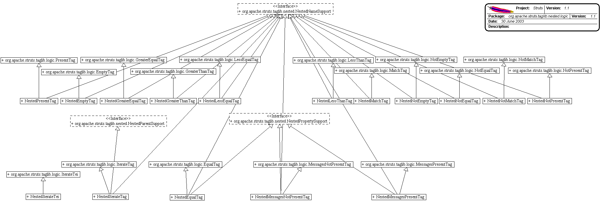

------------------------------------------------------------------------

 

<table>
<colgroup>
<col width="50%" />
<col width="50%" />
</colgroup>
<tbody>
<tr class="odd">
<td align="left">
<table>
<tbody>
<tr class="odd">
<td align="left"><a href="../../../../../../overview-summary.html.md"><strong>Overview</strong></a> </td>
<td align="left"> <strong>Package</strong> </td>
<td align="left">Class </td>
<td align="left"><a href="package-use.html.md"><strong>Use</strong></a> </td>
<td align="left"><a href="package-tree.html.md"><strong>Tree</strong></a> </td>
<td align="left"><a href="../../../../../../deprecated-list.html.md"><strong>Deprecated</strong></a> </td>
<td align="left"><a href="../../../../../../index-all.html.md"><strong>Index</strong></a> </td>
<td align="left"><a href="../../../../../../help-doc.html.md"><strong>Help</strong></a> </td>
</tr>
</tbody>
</table></td>
<td align="left"></td>
</tr>
<tr class="even">
<td align="left"> <a href="../../../../../../org/apache/struts/taglib/nested.html.md/package-summary.html"><strong>PREV PACKAGE</strong></a>   <a href="../../../../../../org/apache/struts/tiles/package-summary.html"><strong>NEXT PACKAGE</strong></a></td>
<td align="left"><a href="../../../../../../index.html.md?org/apache/struts/taglib/nested/logic/package-summary.html"><strong>FRAMES</strong></a>    <a href="package-summary.html"><strong>NO FRAMES</strong></a>    
<a href="../../../../../../allclasses-noframe.html.md"><strong>All Classes</strong></a></td>
</tr>
</tbody>
</table>

------------------------------------------------------------------------

Package org.apache.struts.taglib.nested.logic
---------------------------------------------

The nested.html.md tags extend the `org.apache.struts.taglib.logic` tags to allow them to relate to each other in a nested nature.

**See:**
           [**Description**](#package_description)

**Class Summary**

**[NestedEmptyTag](../../../../../../org/apache/struts/taglib/nested/logic/NestedEmptyTag.html.md "class in org.apache.struts.taglib.nested.logic")**

NestedEmptyTag.

**[NestedEqualTag](../../../../../../org/apache/struts/taglib/nested/logic/NestedEqualTag.html.md "class in org.apache.struts.taglib.nested.logic")**

NestedEqualTag.

**[NestedGreaterEqualTag](../../../../../../org/apache/struts/taglib/nested/logic/NestedGreaterEqualTag.html.md "class in org.apache.struts.taglib.nested.logic")**

NestedGreaterEqualTag.

**[NestedGreaterThanTag](../../../../../../org/apache/struts/taglib/nested/logic/NestedGreaterThanTag.html.md "class in org.apache.struts.taglib.nested.logic")**

NestedGreaterThanTag.

**[NestedIterateTag](../../../../../../org/apache/struts/taglib/nested/logic/NestedIterateTag.html.md "class in org.apache.struts.taglib.nested.logic")**

NestedIterateTag.

**[NestedIterateTei](../../../../../../org/apache/struts/taglib/nested/logic/NestedIterateTei.html.md "class in org.apache.struts.taglib.nested.logic")**

NestedIterateTei Extending the original tag's tei class, so that we can make the "id" attribute optional, so that those who want to script can add it if they need it otherwise we can maintain the nice lean tag markup.

**[NestedLessEqualTag](../../../../../../org/apache/struts/taglib/nested/logic/NestedLessEqualTag.html.md "class in org.apache.struts.taglib.nested.logic")**

NestedLessEqualTag.

**[NestedLessThanTag](../../../../../../org/apache/struts/taglib/nested/logic/NestedLessThanTag.html.md "class in org.apache.struts.taglib.nested.logic")**

NestedLessThanTag.

**[NestedMatchTag](../../../../../../org/apache/struts/taglib/nested/logic/NestedMatchTag.html.md "class in org.apache.struts.taglib.nested.logic")**

NestedMatchTag.

**[NestedMessagesNotPresentTag](../../../../../../org/apache/struts/taglib/nested/logic/NestedMessagesNotPresentTag.html.md "class in org.apache.struts.taglib.nested.logic")**

NestedMessagesNotPresentTag.

**[NestedMessagesPresentTag](../../../../../../org/apache/struts/taglib/nested/logic/NestedMessagesPresentTag.html.md "class in org.apache.struts.taglib.nested.logic")**

NestedMessagesPresentTag.

**[NestedNotEmptyTag](../../../../../../org/apache/struts/taglib/nested/logic/NestedNotEmptyTag.html.md "class in org.apache.struts.taglib.nested.logic")**

NestedNotEmptyTag.

**[NestedNotEqualTag](../../../../../../org/apache/struts/taglib/nested/logic/NestedNotEqualTag.html.md "class in org.apache.struts.taglib.nested.logic")**

NestedNotEqualTag.

**[NestedNotMatchTag](../../../../../../org/apache/struts/taglib/nested/logic/NestedNotMatchTag.html.md "class in org.apache.struts.taglib.nested.logic")**

NestedNotMatchTag.

**[NestedNotPresentTag](../../../../../../org/apache/struts/taglib/nested/logic/NestedNotPresentTag.html.md "class in org.apache.struts.taglib.nested.logic")**

NestedNotPresentTag.

**[NestedPresentTag](../../../../../../org/apache/struts/taglib/nested/logic/NestedPresentTag.html.md "class in org.apache.struts.taglib.nested.logic")**

NestedPresentTag.

 

Package org.apache.struts.taglib.nested.logic Description
---------------------------------------------------------

The nested.html.md tags extend the `org.apache.struts.taglib.logic` tags to allow them to relate to each other in a nested nature. The fundamental logic of the logic tags don't change, except in that all references to beans and bean properties will be managed in a nested context.
 

------------------------------------------------------------------------

 

<table>
<colgroup>
<col width="50%" />
<col width="50%" />
</colgroup>
<tbody>
<tr class="odd">
<td align="left">
<table>
<tbody>
<tr class="odd">
<td align="left"><a href="../../../../../../overview-summary.html.md"><strong>Overview</strong></a> </td>
<td align="left"> <strong>Package</strong> </td>
<td align="left">Class </td>
<td align="left"><a href="package-use.html.md"><strong>Use</strong></a> </td>
<td align="left"><a href="package-tree.html.md"><strong>Tree</strong></a> </td>
<td align="left"><a href="../../../../../../deprecated-list.html.md"><strong>Deprecated</strong></a> </td>
<td align="left"><a href="../../../../../../index-all.html.md"><strong>Index</strong></a> </td>
<td align="left"><a href="../../../../../../help-doc.html.md"><strong>Help</strong></a> </td>
</tr>
</tbody>
</table></td>
<td align="left"></td>
</tr>
<tr class="even">
<td align="left"> <a href="../../../../../../org/apache/struts/taglib/nested.html.md/package-summary.html"><strong>PREV PACKAGE</strong></a>   <a href="../../../../../../org/apache/struts/tiles/package-summary.html"><strong>NEXT PACKAGE</strong></a></td>
<td align="left"><a href="../../../../../../index.html.md?org/apache/struts/taglib/nested/logic/package-summary.html"><strong>FRAMES</strong></a>    <a href="package-summary.html"><strong>NO FRAMES</strong></a>    
<a href="../../../../../../allclasses-noframe.html.md"><strong>All Classes</strong></a></td>
</tr>
</tbody>
</table>

------------------------------------------------------------------------

Copyright © 2000-2008 [Apache Software Foundation](http://www.apache.org/). All Rights Reserved.
