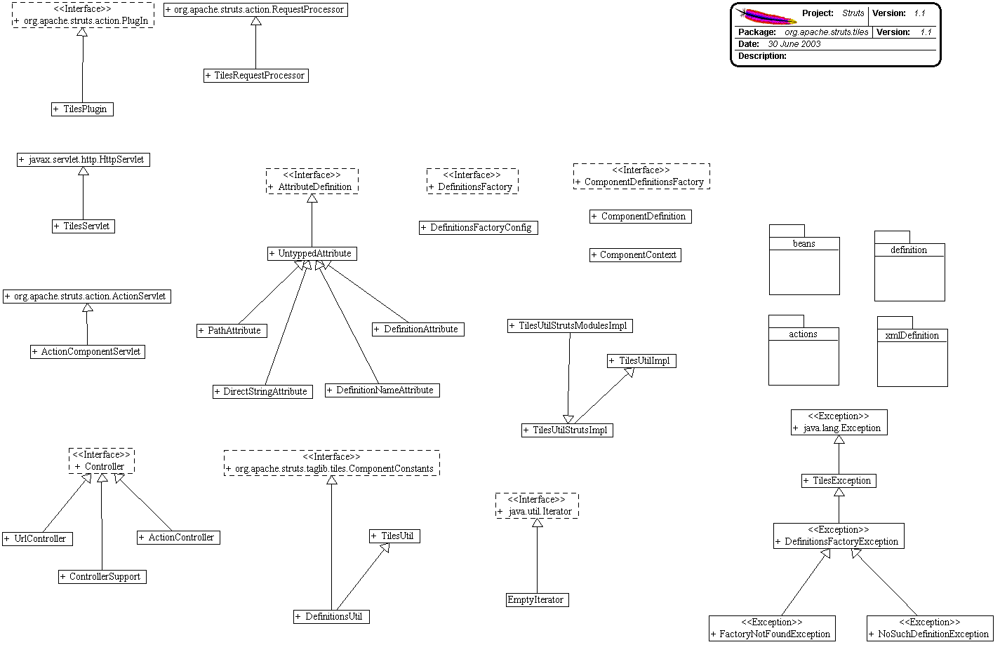
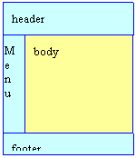

------------------------------------------------------------------------

 

<table>
<colgroup>
<col width="50%" />
<col width="50%" />
</colgroup>
<tbody>
<tr class="odd">
<td align="left">
<table>
<tbody>
<tr class="odd">
<td align="left"><a href="../../../../overview-summary.html.md"><strong>Overview</strong></a> </td>
<td align="left"> <strong>Package</strong> </td>
<td align="left">Class </td>
<td align="left"><a href="package-use.html.md"><strong>Use</strong></a> </td>
<td align="left"><a href="package-tree.html.md"><strong>Tree</strong></a> </td>
<td align="left"><a href="../../../../deprecated-list.html.md"><strong>Deprecated</strong></a> </td>
<td align="left"><a href="../../../../index-all.html.md"><strong>Index</strong></a> </td>
<td align="left"><a href="../../../../help-doc.html.md"><strong>Help</strong></a> </td>
</tr>
</tbody>
</table></td>
<td align="left"></td>
</tr>
<tr class="even">
<td align="left"> <a href="../../../../org/apache/struts/taglib/nested/logic/package-summary.html.md"><strong>PREV PACKAGE</strong></a>   <a href="../../../../org/apache/struts/tiles/actions/package-summary.html"><strong>NEXT PACKAGE</strong></a></td>
<td align="left"><a href="../../../../index.html.md?org/apache/struts/tiles/package-summary.html"><strong>FRAMES</strong></a>    <a href="package-summary.html"><strong>NO FRAMES</strong></a>    
<a href="../../../../allclasses-noframe.html.md"><strong>All Classes</strong></a></td>
</tr>
</tbody>
</table>

------------------------------------------------------------------------

Package org.apache.struts.tiles
-------------------------------

The Tiles taglib and framework allows building web pages by assembling reusable pieces of pages, called Tiles.
**See:**
           [**Description**](#package_description)

**Interface Summary**
**[AttributeDefinition](../../../../org/apache/struts/tiles/AttributeDefinition.html.md "interface in org.apache.struts.tiles")**
Attribute definition used in a component definition.
**[ComponentDefinitionsFactory](../../../../org/apache/struts/tiles/ComponentDefinitionsFactory.html.md "interface in org.apache.struts.tiles")**
**Deprecated.** *Use DefinitionsFactory instead.*
**[Controller](../../../../org/apache/struts/tiles/Controller.html.md "interface in org.apache.struts.tiles")**
A controller is a piece of code called before rendering a jsp page.
**[DefinitionsFactory](../../../../org/apache/struts/tiles/DefinitionsFactory.html.md "interface in org.apache.struts.tiles")**
Tiles Definition factory.
 
**Class Summary**
**[ActionController](../../../../org/apache/struts/tiles/ActionController.html.md "class in org.apache.struts.tiles")**
Struts wrapper implementation of Controller.
**[ComponentContext](../../../../org/apache/struts/tiles/ComponentContext.html.md "class in org.apache.struts.tiles")**
Component context.
**[ComponentDefinition](../../../../org/apache/struts/tiles/ComponentDefinition.html.md "class in org.apache.struts.tiles")**
Definition of a template / component attributes.
**[ControllerSupport](../../../../org/apache/struts/tiles/ControllerSupport.html.md "class in org.apache.struts.tiles")**
Basic implementation of Controller.
**[DefinitionAttribute](../../../../org/apache/struts/tiles/DefinitionAttribute.html.md "class in org.apache.struts.tiles")**
Attribute representing a Component Definition.
**[DefinitionNameAttribute](../../../../org/apache/struts/tiles/DefinitionNameAttribute.html.md "class in org.apache.struts.tiles")**
Component attribute.
**[DefinitionsFactoryConfig](../../../../org/apache/struts/tiles/DefinitionsFactoryConfig.html.md "class in org.apache.struts.tiles")**
A TilesFactoryConfig object hold configuration attributes for a tile definition factory.
**[DefinitionsUtil](../../../../org/apache/struts/tiles/DefinitionsUtil.html.md "class in org.apache.struts.tiles")**
**Deprecated.** *Use [`TilesUtil.createDefinitionsFactory(ServletContext, DefinitionsFactoryConfig)`](../../../../org/apache/struts/tiles/TilesUtil.html.md#createDefinitionsFactory(javax.servlet.ServletContext,%20org.apache.struts.tiles.DefinitionsFactoryConfig))*
**[DirectStringAttribute](../../../../org/apache/struts/tiles/DirectStringAttribute.html.md "class in org.apache.struts.tiles")**
Component attribute.
**[PathAttribute](../../../../org/apache/struts/tiles/PathAttribute.html.md "class in org.apache.struts.tiles")**
Component attribute.
**[RedeployableActionServlet](../../../../org/apache/struts/tiles/RedeployableActionServlet.html.md "class in org.apache.struts.tiles")**
WebLogic (at least v6 and v7) attempts to serialize the TilesRequestProcessor when re-deploying the Webapp in development mode.
**[TilesPlugin](../../../../org/apache/struts/tiles/TilesPlugin.html.md "class in org.apache.struts.tiles")**
Tiles Plugin used to initialize Tiles.
**[TilesRequestProcessor](../../../../org/apache/struts/tiles/TilesRequestProcessor.html.md "class in org.apache.struts.tiles")**
**RequestProcessor** contains the processing logic that the Struts controller servlet performs as it receives each servlet request from the container.
**[TilesUtil](../../../../org/apache/struts/tiles/TilesUtil.html.md "class in org.apache.struts.tiles")**
Class containing utility methods for Tiles.
**[TilesUtilImpl](../../../../org/apache/struts/tiles/TilesUtilImpl.html.md "class in org.apache.struts.tiles")**
Default implementation of TilesUtil.
**[TilesUtilStrutsImpl](../../../../org/apache/struts/tiles/TilesUtilStrutsImpl.html.md "class in org.apache.struts.tiles")**
TilesUtil implementation for Struts 1.1 with one single factory.
**[TilesUtilStrutsModulesImpl](../../../../org/apache/struts/tiles/TilesUtilStrutsModulesImpl.html.md "class in org.apache.struts.tiles")**
Implementation of TilesUtil for Struts multi modules.
**[UntypedAttribute](../../../../org/apache/struts/tiles/UntypedAttribute.html.md "class in org.apache.struts.tiles")**
Common implementation of attribute definition.
**[UrlController](../../../../org/apache/struts/tiles/UrlController.html.md "class in org.apache.struts.tiles")**
Tiles controller including a local URL.
 
**Exception Summary**
**[DefinitionsFactoryException](../../../../org/apache/struts/tiles/DefinitionsFactoryException.html.md "class in org.apache.struts.tiles")**
Exception thrown when an error occurs while the factory tries to create a new instance mapper.
**[FactoryNotFoundException](../../../../org/apache/struts/tiles/FactoryNotFoundException.html.md "class in org.apache.struts.tiles")**
Exception thrown when definitions factory is not found.
**[NoSuchDefinitionException](../../../../org/apache/struts/tiles/NoSuchDefinitionException.html.md "class in org.apache.struts.tiles")**
Exception thrown when a definition is not found.
**[TilesException](../../../../org/apache/struts/tiles/TilesException.html.md "class in org.apache.struts.tiles")**
Root class for all Tiles-exceptions.
 

Package org.apache.struts.tiles Description
-------------------------------------------

The Tiles taglib and framework allows building web pages by assembling reusable pieces of pages, called Tiles. A Tiles is usually a simple JSP page. 
Introduction
------------

The Tiles framework allows building pages by assembling reusable Tiles. As an example, the page in the next figure can be build by assembling a header, a footer, a menu and a body.

Each Tiles (header, menu, body, ...) is a JSP page and can itself be build by assembling other Tiles.

Using Tiles can be compared as using Java methods: You need to define the Tiles (the method body), and then you can "call" this body anywhere you want, passing it some parameters. In Tiles, parameters are called "attributes" in order to avoid confusion with the request parameters.

The Tiles body can be a simple JSP page, a Struts action or any URI pointing to a resource inside the current web site.

Inserting the body, or calling it, is done with the tag \<tiles:insert ...\> anywhere in a JSP page. Insertion can also be done by specifying a *definition name* as the path of a Struts forward or as input, forward or include attributes of a Struts action.

Tiles bodies are used to create layouts, reusable parts, ... Tiles insertions are used to insert Tiles. The same Tiles can be reused several times in the same site, or even in the same page.

Insertion of a Tiles body can be associated to a logical name in what Tiles calls a "definition". A definition contains a logical name, a page used as body and some attribute values. The definition declaration doesn't insert the associated Tiles body. It just associates it with the name. A definition name can be used anywhere insertion of a Tiles body can occur. The associated Tiles body is then inserted with associated attributes.

The definition declarations can be done in JSP pages or in one or more centralized files. A definition can extend another one, overload some attributes, add new attributes ... This allows the declaration of a "master" definition declaring the common layout, header, menu and footer. All other definitions extend this master layout thereby making it possible to change the entire site look & feel simply by changing the master definition.

Simple Examples
---------------

### Insert a JSP page

    <tiles:insert page="/layouts/commonLayout.jsp" flush="true" />

This example inserts the specified page in place of the tag. The page attribute is any valid URL pointing to a resource inside the current site.

### Insert a Tiles passing some attributes

    <tiles:insert page="/layouts/classicLayout.jsp" flush=&quot;true">
      <tiles:put name="title"  value="Page Title" />
      <tiles:put name="header" value="/common/header.jsp" />
      <tiles:put name="footer" value="/common/footer.jsp" />
      <tiles:put name="menu"   value="/common/menu.jsp" />
      <tiles:put name="body"   value="/tiles/mainBody.jsp" />
    </tiles:insert>

This example inserts the specified page, passing it the attributes. Attributes are stored in a Tiles context which is passed to the inserted pag and can then be accesssed by their names.

### Retrieve an attribute value as String

    <tiles:getAsString name="title" />

This example retrieves the value of the attribute "title" and prints it as a String in the current output stream. The method toString() is applied on the attribute value, allowing to pass any kind of object as value.

### Insert Tiles referenced by an attribute

    <tiles:insert attribute='menu' />

This inserts the Tiles referenced by the attribute "menu" value. The specified attribute value is first retrieved from current Tiles's context, and then the value is used as a page target to insert.

### Classic Layout

This example is a layout assembling a page in the classic header-footer-menu-body fashion.

    <%@ taglib uri="/WEB-INF/struts-tiles.tld" prefix="tiles" %>
    <HTML>
      <HEAD>
        <link rel="stylesheet" href="<%=request.getContextPath()%>/layouts/stylesheet.css" 
                      type="text/css"/>
        <title><tiles:getAsString name="title"/></title>
      </HEAD>
    <body>
    <table border="0" width="100%" cellspacing="5">
    <tr>
      <td colspan="2"><tiles:insert attribute="header" /></td>
    </tr>
    <tr>
      <td width="140" valign="top">
        <tiles:insert attribute='menu' />
      </td>
      <td valign="top"  align="left">
        <tiles:insert attribute='body' />
      </td>
    </tr>
    <tr>
      <td colspan="2">
        <tiles:insert attribute="footer" />
      </td>
    </tr>
    </table>
    </body>
    <.html.md>

The layout is declared in a JSP page (ex: /layouts/classicLayout.jsp). It can be used in conjunction with the tag described in "[Insert a page passing some attributes](#doc.InsertPageWithAttributes)".

Definitions
-----------

A definition associates a logical name with the URL of a Tiles to be inserted and some attribute values. A definition doesn't insert the Tiles. This is done later using the definition name. A definition name can be inserted as often as you want in your site, making it easy to reuse a Tiles.

A definition can extend another definition and overload some attributes or add new ones. This makes easy factorization of definitions differing by some attributes. For example, you can define a master definition declaring the main header, menu, footer, and a default title. Then let each of your page definitions extend this master definition and overload the title and the body.

Definitions can be declared in a JSP page, or in one or more centralized files. To enable the definitions from centralized files, you need to initialize the "definitions factory&&quot; which will parse the definitions from the files and provide them to the Tiles framework.

### Enabling Definition Factory

To enable Tiles definitions described in one or more files, you need to write these files and to initialize the definition factory.

Initialization is different depending on the Struts version you use, or if you do not use Struts at all.

#### Struts1.1

Use the Tiles plug-in to enable Tiles definitions. This plug-in creates the definition factory and passese it a configuration object populated with parameters. Parameters can be specified in the web.xml file or as plug-in parameters. The plug-in first reads parameters from web.xml, and then overloads them with the ones found in the plug-in. All parameters are optional and can be omitted. The plug-in should be declared in each struts-config file:

      <plug-in className=&&quot;org.apache.struts.tiles.TilesPlugin&&quot; >
        <set-property property=&&quot;definitions-config&&quot; 
                             value=&&quot;/WEB-INF/tiles-defs.xml,
                                /WEB-INF/tiles-tests-defs.xml,/WEB-INF/tiles-tutorial-defs.xml,
                                /WEB-INF/tiles-examples-defs.xml&&quot; />
        <set-property property=&&quot;moduleAware&&quot; value=&&quot;true&&quot; />
        <set-property property=&&quot;definitions-parser-validate&&quot; value=&&quot;true&&quot; />
      </plug-in>

-   definitions-config: (optional)
    -   Specify configuration file names. There can be several comma separated file names (default: ?? )
-   definitions-parser-validate: (optional)
    -   Specify if XML parser should validate the Tiles configuration file
        -   true : validate. DTD should be specified in file header (default)
        -   false : no validation
-   moduleAware: (optional)
    -   Specify if the Tiles definition factory is module aware. If true (default), there will be one factory for each Struts module. If false, there will be one common factory for all module. In this later case, it is still needed to declare one plugin per module. The factory will be initialized with parameters found in the first initialized plugin (generally the one associated with the default module).
        -   true : Tiles framework is module aware
        -   false :Tiles framework has one single factoy shared among modules (default)
-   tilesUtilImplClassname: (optional - for advanced user)
    -   Specify The classname of the TilesUtil implementation to use. The specified class should be a subclass of TilesUtilStrutsImpl. This option disable the moduleAware option.
         Specifying &&quot;TilesUtilStrutsImpl&&quot; is equivalent to moduleAware = false.
         Specifying &&quot;TilesUtilStrutsModuleImpl&&quot; is equivalent to moduleAware = true.
         This option is taken into account only once, when it is first encountered. To avoid problems, it is advice to specify the same values in all TilesPlugin declaration.

The TilesPlugin class creates one definition factory for each struts module.

If the flag moduleAware is false, only one shared factory is created for all modules. In this later case, the factory is initialized with parameters found in the first plugin. The plugins should be declared in all modules, and the moduleAware flag should be the same for the entire application.

Paths found in Tiles definitions are relative to the main context.

You don't need to specify a TilesRequestProcessor, this is automatically done by the plug-in. If, however, you want to specify your own RequestProcessor, it should extend the TilesRequestProcessor. The plug-in checks this constraint.

#### Struts1.0.x

You need to use a special servlet extending the Struts servlet. This is specified in the web.xml file of your application:

      <servlet>
        <servlet-name>action</servlet-name>
            <servlet-class>org.apache.struts.tiles.ActionComponentServlet</servlet-class>   
            <!-- Tiles Servlet parameter 
                      Specify configuration file names. There can be several comma 
                      separated file names
                    -->  
            <init-param>
          <param-name>definitions-config</param-name>
          <param-value>/WEB-INF/tiles-defs.xml</param-value>
        </init-param>
            <!-- Tiles Servlet parameter 
                    Specify if XML parser should validate the Tiles configuration file(s).
                    true : validate. DTD should be specified in file header.
                    false : no validation
                    -->  
        <init-param>
          <param-name>definitions-parser-validate</param-name>
          <param-value>true</param-value>
        </init-param>
         ...
      </servlet>

#### Without Struts

Tiles can be used without Struts. To initialize the definition factory, you can use the provided servlet. Declare it in the web.xml file of your application:

      <servlet>
        <servlet-name>action</servlet-name>
        <servlet-class>org.apache.struts.tiles.TilesServlet</servlet-class>

            <init-param>
          <param-name>definitions-config</param-name>
          <param-value>/WEB-INF/tiles-defs.xml</param-value>
        </init-param>
        <init-param>
          <param-name>definitions-parser-validate</param-name>
          <param-value>true</param-value>
        </init-param>
       ...

The parameters are the same as for Struts1.1 or 1.0.

### Definition File Syntax

The definition file syntax can be found in the [tiles-config\_1\_1.dtd file](http://struts.apache.org/dtds/tiles-config_1_1.dtd).

Following is a simple example:

    <!DOCTYPE tiles-definitions PUBLIC
           &&quot;-//Apache Software Foundation//DTD Tiles Configuration//EN&&quot;
           &&quot;http://struts.apache.org/dtds/tiles-config_1_1.dtd&&quot;>

    <!-- Definitions for Tiles documentation   -->
    <tiles-definitions>

      <!-- ========================================================== -->
      <!-- Master definition                                          -->
      <!-- ========================================================== -->
      <!-- Main page layout used as a root for other page definitions -->

      <definition name=&&quot;site.mainLayout&&quot; path=&&quot;/layouts/classicLayout.jsp&&quot;>
              <put name=&&quot;title&&quot;  value=&&quot;Tiles Blank Site&&quot; />
              <put name=&&quot;header&&quot; value=&&quot;/tiles/common/header.jsp&&quot; />
              <put name=&&quot;menu&&quot;   value=&&quot;site.menu.bar&&quot; />
              <put name=&&quot;footer&&quot; value=&&quot;/tiles/common/footer.jsp&&quot; />
              <put name=&&quot;body&&quot;   value=&&quot;/tiles/body.jsp&&quot; />
      </definition>

      <!-- ========================================================== -->
      <!-- Index page definition                                      -->
      <!-- ========================================================== -->
        <!-- This definition inherits from the main definition.
              It overloads the page title and the body used.
              Use the same mechanism to define new pages sharing common 
              properties (here header, menu, footer, layout)
            -->

      <definition name=&&quot;site.index.page&&quot; extends=&&quot;site.mainLayout&&quot; >
              <put name=&&quot;title&&quot;  value=&&quot;Tiles Blank Site Index&&quot; />
              <put name=&&quot;body&&quot;   value=&&quot;/tiles/body.jsp&&quot; />
      </definition>

    </tiles-definition>

### Debugging

To debug a page made of Tiles, you can use following advices:

-   Check each Tiles separatly. Try to access nested Tiles directly to test if thes work properly.
-   Enable Tiles logging. See the commons-logging package help.

------------------------------------------------------------------------

 
<table>
<colgroup>
<col width="50%" />
<col width="50%" />
</colgroup>
<tbody>
<tr class="odd">
<td align="left">
<table>
<tbody>
<tr class="odd">
<td align="left"><a href="../../../../overview-summary.html.md"><strong>Overview</strong></a> </td>
<td align="left"> <strong>Package</strong> </td>
<td align="left">Class </td>
<td align="left"><a href="package-use.html.md"><strong>Use</strong></a> </td>
<td align="left"><a href="package-tree.html.md"><strong>Tree</strong></a> </td>
<td align="left"><a href="../../../../deprecated-list.html.md"><strong>Deprecated</strong></a> </td>
<td align="left"><a href="../../../../index-all.html.md"><strong>Index</strong></a> </td>
<td align="left"><a href="../../../../help-doc.html.md"><strong>Help</strong></a> </td>
</tr>
</tbody>
</table></td>
<td align="left"></td>
</tr>
<tr class="even">
<td align="left"> <a href="../../../../org/apache/struts/taglib/nested/logic/package-summary.html.md"><strong>PREV PACKAGE</strong></a>   <a href="../../../../org/apache/struts/tiles/actions/package-summary.html"><strong>NEXT PACKAGE</strong></a></td>
<td align="left"><a href="../../../../index.html.md?org/apache/struts/tiles/package-summary.html"><strong>FRAMES</strong></a>    <a href="package-summary.html"><strong>NO FRAMES</strong></a>    
<a href="../../../../allclasses-noframe.html.md"><strong>All Classes</strong></a></td>
</tr>
</tbody>
</table>

------------------------------------------------------------------------

Copyright © 2000-2008 [Apache Software Foundation](http://www.apache.org/). All Rights Reserved.
