 

------------------------------------------------------------------------

Last Published: 2008-11-29

[Apache](http://www.apache.org/) | [Struts 2](../2.x/) | [Struts 1](../1.x/)

------------------------------------------------------------------------

##### Struts 1

-   [Welcome](../index.html.md)
-   [Learning](../learning.html.md)
-   [Roadmap](../roadmap.html.md)
-   [Releases](../downloads.html.md)

##### Documentation

-   [User Guide](../userGuide/index.html.md)
-   [FAQs and HOWTOs](../faqs/index.html.md)
-   [Release Notes](../userGuide/release-notes.html.md)
-   [Javadoc](../apidocs/index.html.md)
-   [DTDDoc](../dtddoc/index.html.md)

##### Support

-   [User Mailing List](../mail.html.md)
-   [Issue Tracker (JIRA)](http://issues.apache.org/struts/)
-   [Wiki Pages](http://wiki.apache.org/struts/)

##### Components

-   [Struts Apps](../struts-apps/index.html.md)
-   [Struts EL](../struts-el/index.html.md)
-   [Struts Extras](../struts-extras/index.html.md)
-   [Struts Faces](../struts-faces/index.html.md)
-   [Struts Scripting](../struts-scripting/index.html.md)
-   [Struts Taglib](../struts-taglib/index.html.md)
-   [Struts Tiles](../struts-tiles/index.html.md)

##### Project Documentation

-   [Project Information](../project-info.html.md)
-   [Project Reports](../project-reports.html.md)

How to setup a basic Struts project using Eclipse IDE
-----------------------------------------------------------------------------------------------------------------------------

### Legal Disclamer

\* DISCLAIMER - This simple How-To shows you one of many ways to setup a working project using
 the Struts framework. This is mainly geared toward Struts users who are new to Eclipse, and
 don't want to spend a lot of time figuring out the differences between their old IDE (if any)
 and this one.
 I will also apologize ahead of time for the formatting of this page.

In this How-To, I will demonstrate (using Eclipse 2.0.1) how to setup, compile, run,
 and debug the struts-mailreader web application that is part of the Struts Applications subproject.
 Next, I will modify the code to pull some data from a MySql database using the popular
 relational mapping tool OJB. (This is actually quite simple)

### Let's get started

Before we begin, you will need to create a directory somewhere to store your project.
 I typically use C:\\personal\\development\\Projects\\(some project)
 Once that's done, extract the struts-mailreader.war to that directory
 (using your favorite zip utility)
 Delete the META-INF folder because this will be created during the build/jar/war process.
 Add a build.xml file to the project root. I use something like this:

                        <project name="Struts Mailreader" default="main"
                        basedir=".">

                        <!-- This is a basic build script, only the minimums
                        here -->

                        <!-- Tell ant to use my environment variables -->
                        <property environment="env"/>

                        <property file="./build.properties"/>

                        <!--
                        This build script assumes Tomcat 5 is the servlet
                        container.
                        Modify as necessary if a different container is being
                        used.
                        -->
                        <property name="tomcat.home"
                        value="${env.CATALINA_HOME}"/>
                        <property name="servlet.jar"
                        value="${tomcat.home}/common/lib/servlet-api.jar"/>
                        <property name="jsp.jar"
                        value="${tomcat.home}/common/lib/jsp-api.jar"/>
                        <property name="deploy.dir"
                        value="${tomcat.home}/webapps"/>
                        <property name="build.compiler" value="modern"/>
                        <property name="build.dir" value="./WEB-INF/classes" />
                        <property name="src.dir" value="./WEB-INF/src"/>
                        <property name="war.file" value="struts-mailreader"/>
                        <property name="war.file.name" value="${war.file}.war"/>

                        <path id="project.class.path">
                        <fileset dir="./WEB-INF/lib/">
                        <include name="**/*.jar"/>
                        </fileset>
                        <pathelement path="${src.dir}"/>
                        <pathelement path="${servlet.jar}"/>
                        <pathelement path="${jsp.jar}"/>
                        </path>

                        <target name="clean">
                        <delete dir="${build.dir}" includeEmptyDirs="true" />
                        </target>

                        <target name="prep">
                        <mkdir dir="${build.dir}"/>
                        </target>

                        <target name="compile">
                        <javac srcdir="${src.dir}"
                        destdir="${build.dir}"
                        debug="on"
                        deprecation="on">
                        <include name="**/*.java"/>
                        <classpath refid="project.class.path"/>
                        </javac>
                        </target>

                        <target name="cleanWebApp">
                        <delete file="${deploy.dir}/${war.file.name}" />
                        <delete dir="${deploy.dir}/${war.file}"
                        includeEmptyDirs="true" />
                        </target>

                        <target name="war">
                        <war warfile="${war.file.name}"
                        webxml="./WEB-INF/web.xml">
                        <fileset dir="./" includes="**/*.*" excludes="*.war,
                        **/*.nbattrs, web.xml, **/WEB-INF/**/*.*,
                        **/project-files/**/*.*"/>
                        <webinf dir="./WEB-INF" includes="**/*"
                        excludes="web.xml, **/*.jar, **/*.class"/>
                        <lib dir="./WEB-INF/lib"/>
                        <classes dir="${build.dir}"/>
                        <classes dir="${src.dir}">
                        <include name="**/*.properties"/>
                        </classes>
                        </war>
                        </target>

                        <target name="deploy">
                        <copy todir="${deploy.dir}">
                        <fileset dir="./" includes="${war.file.name}"/>
                        </copy>
                        </target>

                        <target name="main" depends="clean, prep, cleanWebApp,
                        compile, war"/>

                        </project>

                    

1.  Create a new project.
     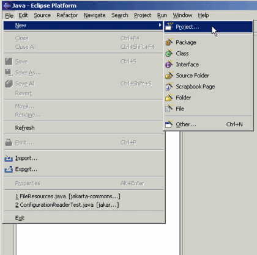
2.  New Java Project
     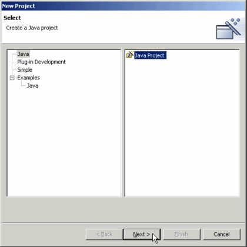
3.  Browse for the folder you created for your project.
     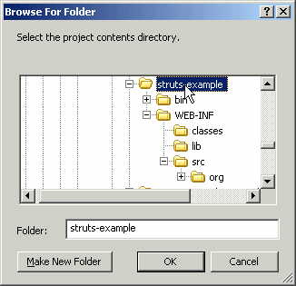
     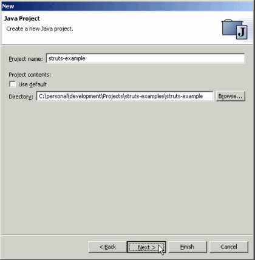
4.  Eclipse will detect your source folders from any subdirectories under your project.
     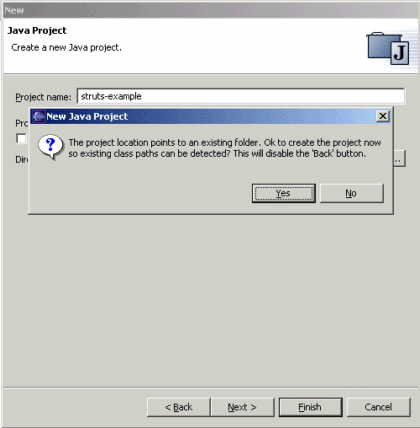
5.  In our case, this is where the src folder was placed.
     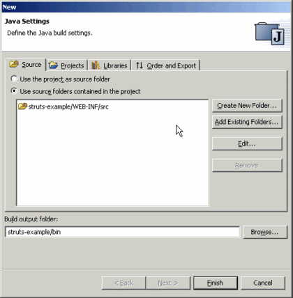
6.  Default standard libs are automatically added depending on the type of project.
     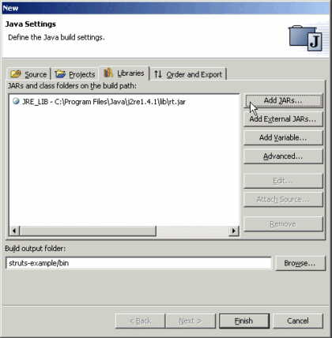
7.  Add the existing web app jars.
     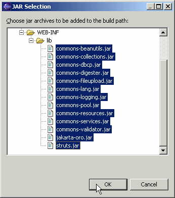
8.  Now we need to add a few jars from the file system.
     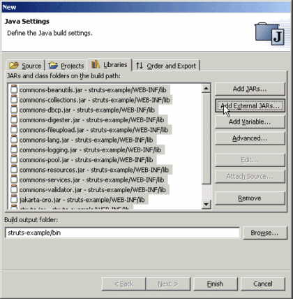
9.  We always need this one (servlet.jar)
     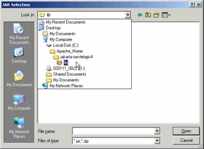
10. Ahhhh...everything looks ok for now. You can always go back and modify these settings
     later.
     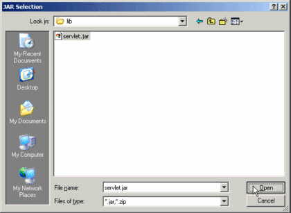
     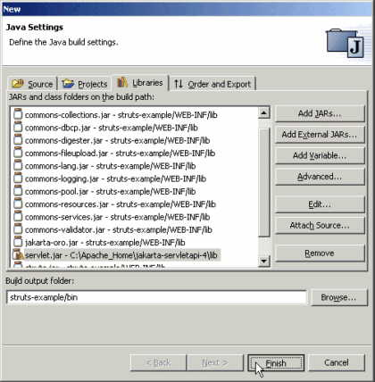
11. When everything settles down, you should see something like this (of course, it might look different depending on your installation/customization):
     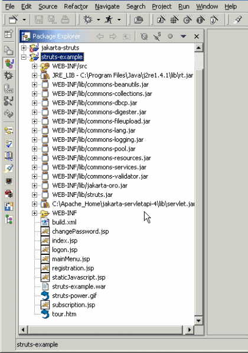
12. Compilation warnings and errors are detected immediately. In this screenshot, I drill down
     into the source folder, package, file, class, and double click on the method....which
     brings up the source editor. I hover the mouse over the offending warning to see
     a description of what's wrong.
     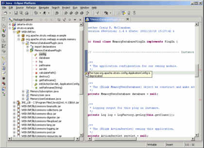
13. I changed ApplicationConfig to ModuleConfig, then saved and now I see new errors.
     You can right click and import ModuleConfig right from the error.
     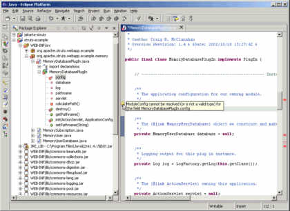
14. A quick look at the import section.
     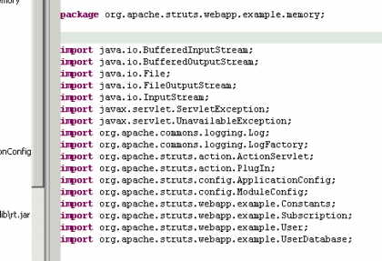
15. Right click, Source, Organize Imports
     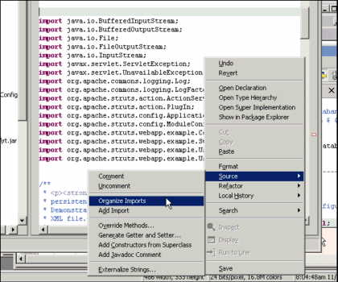
16. Ahhhh...better
     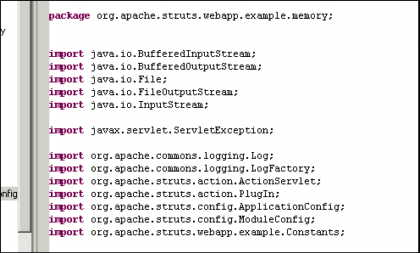
17. From the Package Explorer, right click your build.xml and run Ant:
     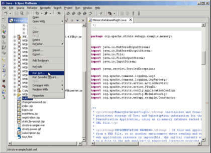
18. Is this cool or what?
     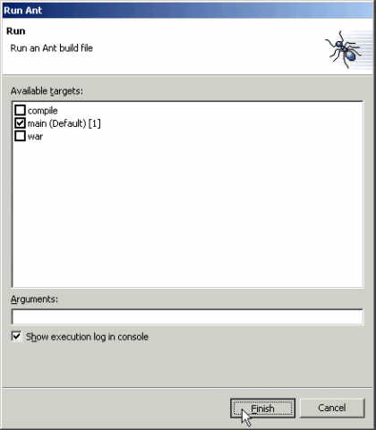
19. Uh Oh!
     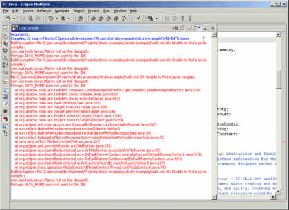
20. Quick look at what jars are being used to process my build.
     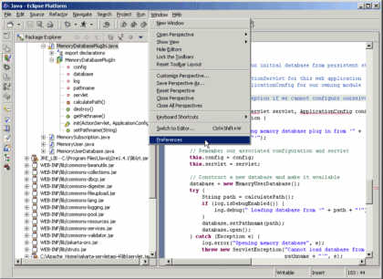
     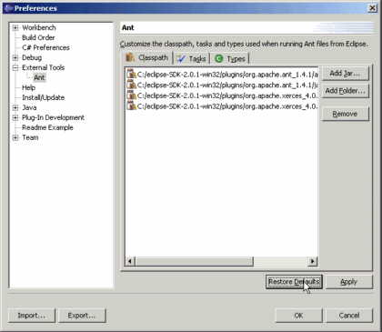
21. I simply removed all the existing jars from the IDE's Ant configuration and
     added all from my own installation.
     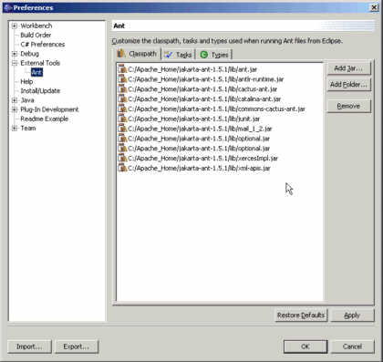
22. Can't forget that last one
     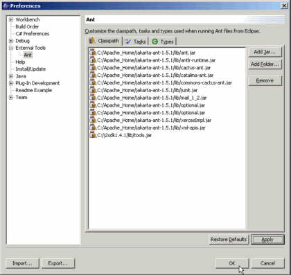
23. Everything went ok (for me)
     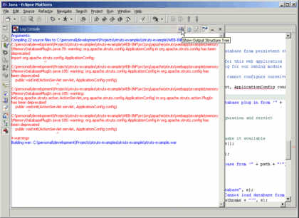
     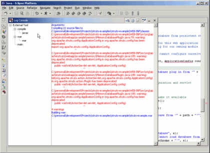
     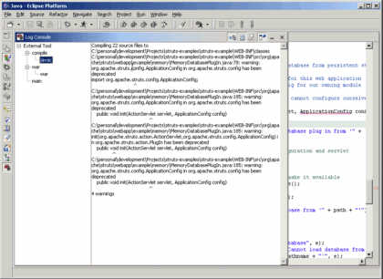
24. Time to test-drive
     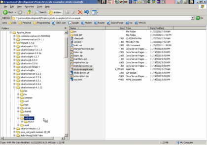

------------------------------------------------------------------------

© 2000-2008 Apache Software Foundation

------------------------------------------------------------------------

