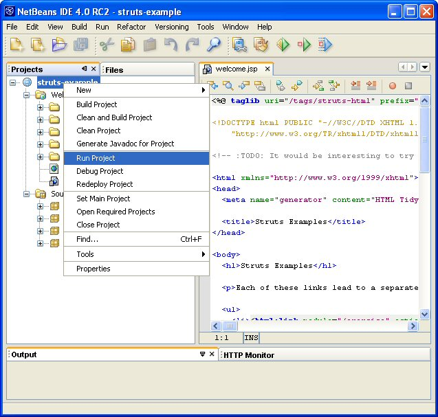

 

------------------------------------------------------------------------

Last Published: 2008-11-29

[Apache](http://www.apache.org/) | [Struts 2](../2.x/) | [Struts 1](../1.x/)

------------------------------------------------------------------------

##### Struts 1

-   [Welcome](../index.html.md)
-   [Learning](../learning.html.md)
-   [Roadmap](../roadmap.html.md)
-   [Releases](../downloads.html.md)

##### Documentation

-   [User Guide](../userGuide/index.html.md)
-   [FAQs and HOWTOs](../faqs/index.html.md)
-   [Release Notes](../userGuide/release-notes.html.md)
-   [Javadoc](../apidocs/index.html.md)
-   [DTDDoc](../dtddoc/index.html.md)

##### Support

-   [User Mailing List](../mail.html.md)
-   [Issue Tracker (JIRA)](http://issues.apache.org/struts/)
-   [Wiki Pages](http://wiki.apache.org/struts/)

##### Components

-   [Struts Apps](../struts-apps/index.html.md)
-   [Struts EL](../struts-el/index.html.md)
-   [Struts Extras](../struts-extras/index.html.md)
-   [Struts Faces](../struts-faces/index.html.md)
-   [Struts Scripting](../struts-scripting/index.html.md)
-   [Struts Taglib](../struts-taglib/index.html.md)
-   [Struts Tiles](../struts-tiles/index.html.md)

##### Project Documentation

-   [Project Information](../project-info.html.md)
-   [Project Reports](../project-reports.html.md)

How to setup a basic Struts project using NetBeans IDE 4.0
---------------------------------------------------------------------------------------------------------------------------------------

Legal Disclamer
-------------------------------------------------

Please read [this](http://jakarta.apache.org/site/idedevelopers.html.md) first.
\* DISCLAIMER - This simple How-To shows you how easy it is to use NetBeans IDE 4.0 to write code for the Struts
 Action Framework. It just works straight out of the box. Simply specify where your sources are
 and where you want to store your application, and NetBeans IDE 4.0 does everything
 you need -- it even generates a customized Ant build script for you and hooks its targets
 up to IDE commands such as "Build" and "Run".
 This is mainly geared toward Struts users who are new to NetBeans IDE 4.0, and don't want to spend a lot of time figuring out the differences between their old IDE and this one.

Let's get started
----------------------------------------------------

You will use wizards to set up and deploy the struts-mailreader in 5 steps.
 Before we begin, let's create (or reuse) a folder to hold the project. Copy the struts-mailreader.war
 from the Struts Applications distribution and extract it, with the result that it looks like this:
 
1.  Create a new project.
     
2.  The New Project wizard appears. Select "Web Project with Existing Sources".
     Do this when you want to use your own sources to create a web application, but
     you want the IDE to generate an Ant build script for you.
     
3.  Specify the location of your sources, the location of your new IDE project, and a project name.
     
4.  Drill-down further and specify the location of your web pages, Java sources, and libraries,
     and decide whether you want your application to support J2EE 1.4 or J2EE 1.3.
     
     Now click Finish. That's it! You're done.
     Let's take a look at the result in the Projects window, and notice how
     the Source Editor provides JSP code completion for Struts JSP tag libraries:
     
     Note that code completion for the struts-config.xml file works automatically
     if you have Internet access. If you use a proxy, it must be enabled. If you
     do not have Internet access, you can use the IDE to create an OASIS XML Catalog,
     which enables code completion for the struts-config.xml file.
     Now take a look in the Files window and browse through the Ant build script that the IDE made for you:
     
5.  Finally, run the Mailreader application. Right-click the project node in the Projects window
     and choose Run Project.
     The Run Project command is hooked to the Run target in the IDE-generated Ant script.
     The Run target depends on targets that compile the application, deploy it to the IDE's
     default server, and display it in the IDE's default browser.
     So, when you choose "Run Project", the IDE uses the Ant build script to compile, deploy, and display it!
     
     

Let's set up a blank application
----------------------------------------------------------------------------------

Now you will use wizards to set up a new Struts application in NetBeans IDE 4.0, again in 5 steps.
1.  Create a new project.
     
2.  The New Project wizard appears. Select "Web Application".
     
3.  Specify the location of your new IDE project and a project name,
     and decide whether you want your application to support J2EE 1.4 or J2EE 1.3.
     
     Now click Finish.
4.  Right-click the blank-struts-app node in the Projects window and choose Properties.
     Select Compiling Sources, click Add JAR/Folder and add the libraries from the Struts distribution:
     
     Click OK.
     Now go to the distribution for the struts-blank application on your filesystem.
    -   Copy the struts-config.xml, tlds, and all the other configuration files (except the web.xml file)
         from the WEB-INF folder and paste them into your web/WEB-INF folder.
    -   Copy MessageResources.properties from WEB-INF/classes/resources into your src folder.

5.  Test your new Struts functionality in the Source Editor:
     

For further information, see:

-   What's New in NetBeans IDE 4.0 ( <http://www.netbeans.org/community/releases/40/whats-new-40.html.md> )
-   Using NetBeans IDE 4.0 ( <http://www.netbeans.org/kb/using-netbeans/40/index.html.md> )

------------------------------------------------------------------------

© 2000-2008 Apache Software Foundation

------------------------------------------------------------------------

