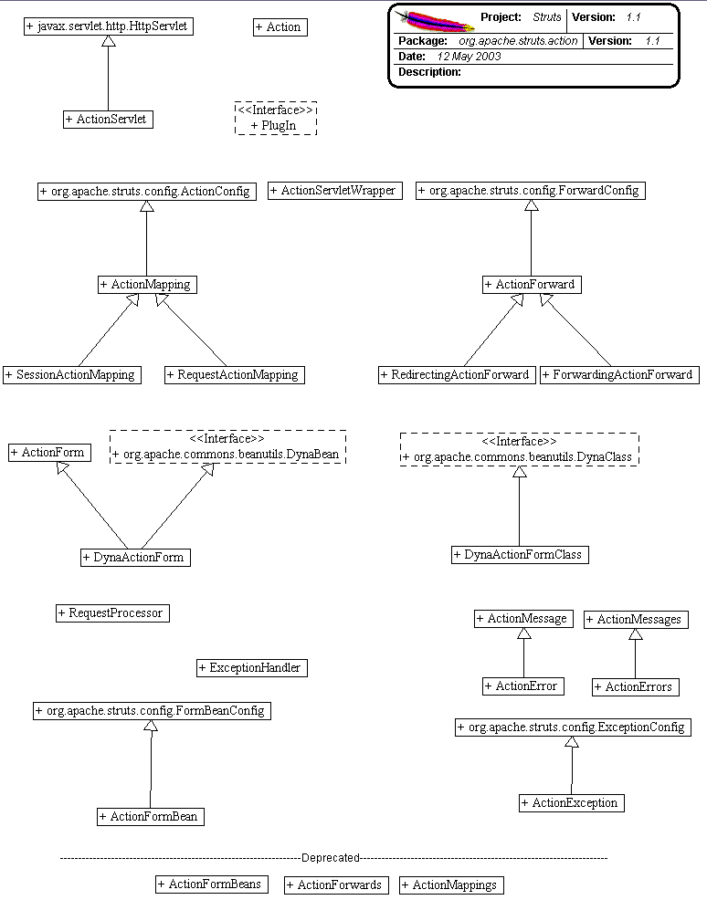

------------------------------------------------------------------------

 

<table>
<colgroup>
<col width="50%" />
<col width="50%" />
</colgroup>
<tbody>
<tr class="odd">
<td align="left">
<table>
<tbody>
<tr class="odd">
<td align="left"><a href="../../../../overview-summary.html.md"><strong>Overview</strong></a> </td>
<td align="left"> <strong>Package</strong> </td>
<td align="left">Class </td>
<td align="left"><a href="package-use.html.md"><strong>Use</strong></a> </td>
<td align="left"><a href="package-tree.html.md"><strong>Tree</strong></a> </td>
<td align="left"><a href="../../../../deprecated-list.html.md"><strong>Deprecated</strong></a> </td>
<td align="left"><a href="../../../../index-all.html.md"><strong>Index</strong></a> </td>
<td align="left"><a href="../../../../help-doc.html.md"><strong>Help</strong></a> </td>
</tr>
</tbody>
</table></td>
<td align="left"></td>
</tr>
<tr class="even">
<td align="left"> <a href="../../../../org/apache/struts/package-summary.html.md"><strong>PREV PACKAGE</strong></a>   <a href="../../../../org/apache/struts/chain/package-summary.html"><strong>NEXT PACKAGE</strong></a></td>
<td align="left"><a href="../../../../index.html.md?org/apache/struts/action/package-summary.html"><strong>FRAMES</strong></a>    <a href="package-summary.html"><strong>NO FRAMES</strong></a>    
<a href="../../../../allclasses-noframe.html.md"><strong>All Classes</strong></a></td>
</tr>
</tbody>
</table>

------------------------------------------------------------------------

Package org.apache.struts.action
--------------------------------

The action package is the core of the struts framework, providing the "Controller" aspect of a MVC model.

**See:**
           [**Description**](#package_description)

**Interface Summary**

**[PlugIn](../../../../org/apache/struts/action/PlugIn.html.md "interface in org.apache.struts.action")**

A **PlugIn** is a configuration wrapper for a module-specific resource or service that needs to be notified about application startup and application shutdown events (corresponding to when the container calls `init` and `destroy` on the corresponding [`ActionServlet`](../../../../org/apache/struts/action/ActionServlet.html.md "class in org.apache.struts.action") instance).

 

**Class Summary**

**[Action](../../../../org/apache/struts/action/Action.html.md "class in org.apache.struts.action")**

An **Action** is an adapter between the contents of an incoming HTTP request and the corresponding business logic that should be executed to process this request.

**[ActionErrors](../../../../org/apache/struts/action/ActionErrors.html.md "class in org.apache.struts.action")**

A class that encapsulates the error messages being reported by the `validate()` method of an `ActionForm`.

**[ActionForm](../../../../org/apache/struts/action/ActionForm.html.md "class in org.apache.struts.action")**

An **ActionForm** is a JavaBean optionally associated with one or more `ActionMappings`.

**[ActionFormBean](../../../../org/apache/struts/action/ActionFormBean.html.md "class in org.apache.struts.action")**

An **ActionFormBean** is the definition of a form bean that is loaded from a `<form-bean>` element in the Struts configuration file.

**[ActionForward](../../../../org/apache/struts/action/ActionForward.html.md "class in org.apache.struts.action")**

An **ActionForward** represents a destination to which the controller, RequestProcessor, might be directed to perform a RequestDispatcher.forward or HttpServletResponse.sendRedirect to, as a result of processing activities of an Action class.

**[ActionMapping](../../../../org/apache/struts/action/ActionMapping.html.md "class in org.apache.struts.action")**

An **ActionMapping** represents the information that the controller, `RequestProcessor`, knows about the mapping of a particular request to an instance of a particular `Action` class.

**[ActionMessage](../../../../org/apache/struts/action/ActionMessage.html.md "class in org.apache.struts.action")**

An encapsulation of an individual message returned by the `validate` method of an `ActionForm`, consisting of a message key (to be used to look up message text in an appropriate message resources database) plus up to four placeholder objects that can be used for parametric replacement in the message text.

**[ActionMessages](../../../../org/apache/struts/action/ActionMessages.html.md "class in org.apache.struts.action")**

A class that encapsulates messages.

**[ActionRedirect](../../../../org/apache/struts/action/ActionRedirect.html.md "class in org.apache.struts.action")**

A subclass of [`ActionForward`](../../../../org/apache/struts/action/ActionForward.html.md "class in org.apache.struts.action") which is designed for use in redirecting requests, with support for adding parameters at runtime.

**[ActionServlet](../../../../org/apache/struts/action/ActionServlet.html.md "class in org.apache.struts.action")**

**ActionServlet** provides the "controller" in the Model-View-Controller (MVC) design pattern for web applications that is commonly known as "Model 2".

**[ActionServletWrapper](../../../../org/apache/struts/action/ActionServletWrapper.html.md "class in org.apache.struts.action")**

Provide a wrapper around an [`ActionServlet`](../../../../org/apache/struts/action/ActionServlet.html.md "class in org.apache.struts.action") to expose only those methods needed by other objects.

**[DynaActionForm](../../../../org/apache/struts/action/DynaActionForm.html.md "class in org.apache.struts.action")**

Specialized subclass of `ActionForm` that allows the creation of form beans with dynamic sets of properties, without requiring the developer to create a Java class for each type of form bean.

**[DynaActionFormClass](../../../../org/apache/struts/action/DynaActionFormClass.html.md "class in org.apache.struts.action")**

Implementation of `DynaClass` for `DynaActionForm` classes that allow developers to define ActionForms without having to individually code all of the classes.

**[ExceptionHandler](../../../../org/apache/struts/action/ExceptionHandler.html.md "class in org.apache.struts.action")**

An **ExceptionHandler** is configured in the Struts configuration file to handle a specific type of exception thrown by an `Action.execute` method.

**[ForwardingActionForward](../../../../org/apache/struts/action/ForwardingActionForward.html.md "class in org.apache.struts.action")**

A subclass of `ActionForward` that defaults the `redirect` attribute to `false`.

**[RedirectingActionForward](../../../../org/apache/struts/action/RedirectingActionForward.html.md "class in org.apache.struts.action")**

A subclass of **ActionForward** that defaults the `redirect` attribute to `true`.

**[RequestActionMapping](../../../../org/apache/struts/action/RequestActionMapping.html.md "class in org.apache.struts.action")**

Subclass of `ActionMapping` that defaults the form bean scope to `request`.

**[RequestProcessor](../../../../org/apache/struts/action/RequestProcessor.html.md "class in org.apache.struts.action")**

**RequestProcessor** contains the processing logic that the [`ActionServlet`](../../../../org/apache/struts/action/ActionServlet.html.md "class in org.apache.struts.action") performs as it receives each servlet request from the container.

**[SessionActionMapping](../../../../org/apache/struts/action/SessionActionMapping.html.md "class in org.apache.struts.action")**

Subclass of `ActionMapping` that defaults the form bean scope to `session`.

 

**Exception Summary**

**[InvalidCancelException](../../../../org/apache/struts/action/InvalidCancelException.html.md "class in org.apache.struts.action")**

Thrown when a token generated by the Cancel tag is found in the request, but the cancellable property for the Action Mapping is not set.

 

Package org.apache.struts.action Description
--------------------------------------------

The action package is the core of the struts framework, providing the "Controller" aspect of a MVC model.

 

Package Specification
---------------------

\#\#\#\#\# FILL IN ANY SPECS NEEDED BY JAVA COMPATIBILITY KIT \#\#\#\#\#

-   [\#\#\#\#\# REFER TO ANY FRAMEMAKER SPECIFICATION HERE \#\#\#\#\#]()

Related Documentation
---------------------

For overviews, tutorials, examples, guides, and tool documentation, please see:

-   [\#\#\#\#\# REFER TO NON-SPEC DOCUMENTATION HERE \#\#\#\#\#]()

------------------------------------------------------------------------

 

<table>
<colgroup>
<col width="50%" />
<col width="50%" />
</colgroup>
<tbody>
<tr class="odd">
<td align="left">
<table>
<tbody>
<tr class="odd">
<td align="left"><a href="../../../../overview-summary.html.md"><strong>Overview</strong></a> </td>
<td align="left"> <strong>Package</strong> </td>
<td align="left">Class </td>
<td align="left"><a href="package-use.html.md"><strong>Use</strong></a> </td>
<td align="left"><a href="package-tree.html.md"><strong>Tree</strong></a> </td>
<td align="left"><a href="../../../../deprecated-list.html.md"><strong>Deprecated</strong></a> </td>
<td align="left"><a href="../../../../index-all.html.md"><strong>Index</strong></a> </td>
<td align="left"><a href="../../../../help-doc.html.md"><strong>Help</strong></a> </td>
</tr>
</tbody>
</table></td>
<td align="left"></td>
</tr>
<tr class="even">
<td align="left"> <a href="../../../../org/apache/struts/package-summary.html.md"><strong>PREV PACKAGE</strong></a>   <a href="../../../../org/apache/struts/chain/package-summary.html"><strong>NEXT PACKAGE</strong></a></td>
<td align="left"><a href="../../../../index.html.md?org/apache/struts/action/package-summary.html"><strong>FRAMES</strong></a>    <a href="package-summary.html"><strong>NO FRAMES</strong></a>    
<a href="../../../../allclasses-noframe.html.md"><strong>All Classes</strong></a></td>
</tr>
</tbody>
</table>

------------------------------------------------------------------------

Copyright © 2000-2008 [Apache Software Foundation](http://www.apache.org/). All Rights Reserved.
