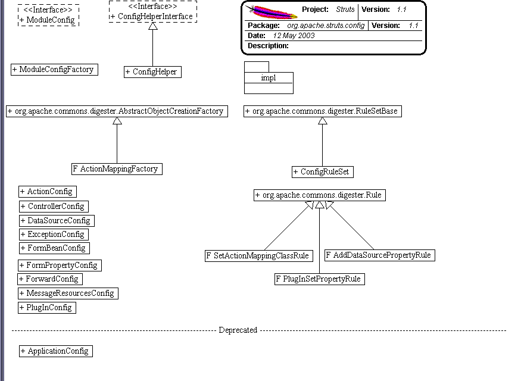

------------------------------------------------------------------------

 

<table>
<colgroup>
<col width="50%" />
<col width="50%" />
</colgroup>
<tbody>
<tr class="odd">
<td align="left">
<table>
<tbody>
<tr class="odd">
<td align="left"><a href="../../../../overview-summary.html.md"><strong>Overview</strong></a> </td>
<td align="left"> <strong>Package</strong> </td>
<td align="left">Class </td>
<td align="left"><a href="package-use.html.md"><strong>Use</strong></a> </td>
<td align="left"><a href="package-tree.html.md"><strong>Tree</strong></a> </td>
<td align="left"><a href="../../../../deprecated-list.html.md"><strong>Deprecated</strong></a> </td>
<td align="left"><a href="../../../../index-all.html.md"><strong>Index</strong></a> </td>
<td align="left"><a href="../../../../help-doc.html.md"><strong>Help</strong></a> </td>
</tr>
</tbody>
</table></td>
<td align="left"></td>
</tr>
<tr class="even">
<td align="left"> <a href="../../../../org/apache/struts/chain/contexts/package-summary.html.md"><strong>PREV PACKAGE</strong></a>   <a href="../../../../org/apache/struts/config/impl/package-summary.html"><strong>NEXT PACKAGE</strong></a></td>
<td align="left"><a href="../../../../index.html.md?org/apache/struts/config/package-summary.html"><strong>FRAMES</strong></a>    <a href="package-summary.html"><strong>NO FRAMES</strong></a>    
<a href="../../../../allclasses-noframe.html.md"><strong>All Classes</strong></a></td>
</tr>
</tbody>
</table>

------------------------------------------------------------------------

Package org.apache.struts.config
--------------------------------

The "config" package contains configuration objects that correspond to elements that may be specified in the `struts-config.xml` module configuration file.

**See:**
           [**Description**](#package_description)

**Interface Summary**

**[ConfigHelperInterface](../../../../org/apache/struts/config/ConfigHelperInterface.html.md "interface in org.apache.struts.config")**

NOTE: THIS CLASS IS UNDER ACTIVE DEVELOPMENT.

**[ModuleConfig](../../../../org/apache/struts/config/ModuleConfig.html.md "interface in org.apache.struts.config")**

The collection of static configuration information that describes a Struts-based module.

 

**Class Summary**

**[ActionConfig](../../../../org/apache/struts/config/ActionConfig.html.md "class in org.apache.struts.config")**

A JavaBean representing the configuration information of an `<action>` element from a Struts module configuration file.

**[ActionConfigMatcher](../../../../org/apache/struts/config/ActionConfigMatcher.html.md "class in org.apache.struts.config")**

Matches paths against pre-compiled wildcard expressions pulled from action configs.

**[BaseConfig](../../../../org/apache/struts/config/BaseConfig.html.md "class in org.apache.struts.config")**

A abstract base class for all config classes.

**[ConfigHelper](../../../../org/apache/struts/config/ConfigHelper.html.md "class in org.apache.struts.config")**

NOTE: THIS CLASS IS UNDER ACTIVE DEVELOPMENT.

**[ConfigRuleSet](../../../../org/apache/struts/config/ConfigRuleSet.html.md "class in org.apache.struts.config")**

The set of Digester rules required to parse a Struts configuration file (`struts-config.xml`).

**[ControllerConfig](../../../../org/apache/struts/config/ControllerConfig.html.md "class in org.apache.struts.config")**

A JavaBean representing the configuration information of a `<controller>` element in a Struts configuration file.

**[ExceptionConfig](../../../../org/apache/struts/config/ExceptionConfig.html.md "class in org.apache.struts.config")**

A JavaBean representing the configuration information of an `<exception>` element from a Struts configuration file.

**[FormBeanConfig](../../../../org/apache/struts/config/FormBeanConfig.html.md "class in org.apache.struts.config")**

A JavaBean representing the configuration information of a `<form-bean>` element in a Struts configuration file.

**[FormPropertyConfig](../../../../org/apache/struts/config/FormPropertyConfig.html.md "class in org.apache.struts.config")**

A JavaBean representing the configuration information of a `<form-property>` element in a Struts configuration file.

**[ForwardConfig](../../../../org/apache/struts/config/ForwardConfig.html.md "class in org.apache.struts.config")**

A JavaBean representing the configuration information of a `<forward>` element from a Struts configuration file.

**[MessageResourcesConfig](../../../../org/apache/struts/config/MessageResourcesConfig.html.md "class in org.apache.struts.config")**

A JavaBean representing the configuration information of a `<message-resources>` element in a Struts configuration file.

**[ModuleConfigFactory](../../../../org/apache/struts/config/ModuleConfigFactory.html.md "class in org.apache.struts.config")**

A factory interface for creating [`ModuleConfig`](../../../../org/apache/struts/config/ModuleConfig.html.md "interface in org.apache.struts.config")s.

**[PlugInConfig](../../../../org/apache/struts/config/PlugInConfig.html.md "class in org.apache.struts.config")**

A JavaBean representing the configuration information of a `<plug-in>` element in a Struts configuration file.

 

Package org.apache.struts.config Description
--------------------------------------------

The "config" package contains configuration objects that correspond to elements that may be specified in the `struts-config.xml` module configuration file.

------------------------------------------------------------------------

 

<table>
<colgroup>
<col width="50%" />
<col width="50%" />
</colgroup>
<tbody>
<tr class="odd">
<td align="left">
<table>
<tbody>
<tr class="odd">
<td align="left"><a href="../../../../overview-summary.html.md"><strong>Overview</strong></a> </td>
<td align="left"> <strong>Package</strong> </td>
<td align="left">Class </td>
<td align="left"><a href="package-use.html.md"><strong>Use</strong></a> </td>
<td align="left"><a href="package-tree.html.md"><strong>Tree</strong></a> </td>
<td align="left"><a href="../../../../deprecated-list.html.md"><strong>Deprecated</strong></a> </td>
<td align="left"><a href="../../../../index-all.html.md"><strong>Index</strong></a> </td>
<td align="left"><a href="../../../../help-doc.html.md"><strong>Help</strong></a> </td>
</tr>
</tbody>
</table></td>
<td align="left"></td>
</tr>
<tr class="even">
<td align="left"> <a href="../../../../org/apache/struts/chain/contexts/package-summary.html.md"><strong>PREV PACKAGE</strong></a>   <a href="../../../../org/apache/struts/config/impl/package-summary.html"><strong>NEXT PACKAGE</strong></a></td>
<td align="left"><a href="../../../../index.html.md?org/apache/struts/config/package-summary.html"><strong>FRAMES</strong></a>    <a href="package-summary.html"><strong>NO FRAMES</strong></a>    
<a href="../../../../allclasses-noframe.html.md"><strong>All Classes</strong></a></td>
</tr>
</tbody>
</table>

------------------------------------------------------------------------

Copyright © 2000-2008 [Apache Software Foundation](http://www.apache.org/). All Rights Reserved.
