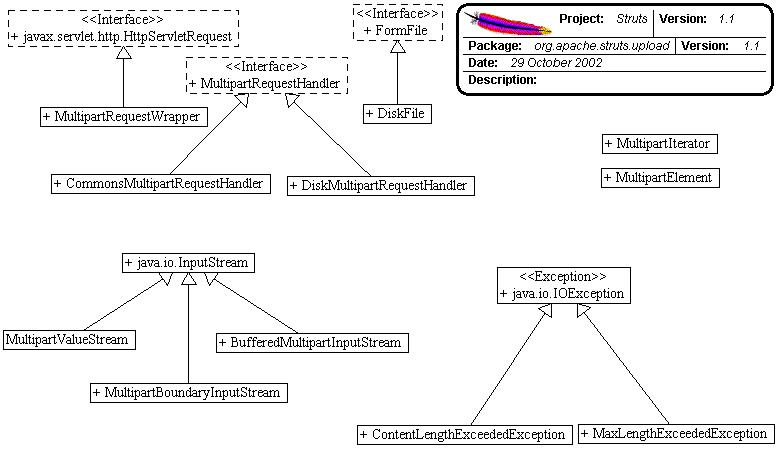

------------------------------------------------------------------------

 

<table>
<colgroup>
<col width="50%" />
<col width="50%" />
</colgroup>
<tbody>
<tr class="odd">
<td align="left">
<table>
<tbody>
<tr class="odd">
<td align="left"><a href="../../../../overview-summary.html.md"><strong>Overview</strong></a> </td>
<td align="left"> <strong>Package</strong> </td>
<td align="left">Class </td>
<td align="left"><a href="package-use.html.md"><strong>Use</strong></a> </td>
<td align="left"><a href="package-tree.html.md"><strong>Tree</strong></a> </td>
<td align="left"><a href="../../../../deprecated-list.html.md"><strong>Deprecated</strong></a> </td>
<td align="left"><a href="../../../../index-all.html.md"><strong>Index</strong></a> </td>
<td align="left"><a href="../../../../help-doc.html.md"><strong>Help</strong></a> </td>
</tr>
</tbody>
</table></td>
<td align="left"></td>
</tr>
<tr class="even">
<td align="left"> <a href="../../../../org/apache/struts/mock/package-summary.html.md"><strong>PREV PACKAGE</strong></a>   <a href="../../../../org/apache/struts/util/package-summary.html"><strong>NEXT PACKAGE</strong></a></td>
<td align="left"><a href="../../../../index.html.md?org/apache/struts/upload/package-summary.html"><strong>FRAMES</strong></a>    <a href="package-summary.html"><strong>NO FRAMES</strong></a>    
<a href="../../../../allclasses-noframe.html.md"><strong>All Classes</strong></a></td>
</tr>
</tbody>
</table>

------------------------------------------------------------------------

Package org.apache.struts.upload
--------------------------------

The upload package facilities to upload files using multi-part requests.

**See:**
           [**Description**](#package_description)

**Interface Summary**

**[FormFile](../../../../org/apache/struts/upload/FormFile.html.md "interface in org.apache.struts.upload")**

This interface represents a file that has been uploaded by a client.

**[MultipartRequestHandler](../../../../org/apache/struts/upload/MultipartRequestHandler.html.md "interface in org.apache.struts.upload")**

MultipartRequestHandler provides an standard interface for struts to deal with file uploads from forms with enctypes of "multipart/form-data".

 

**Class Summary**

**[CommonsMultipartRequestHandler](../../../../org/apache/struts/upload/CommonsMultipartRequestHandler.html.md "class in org.apache.struts.upload")**

This class implements the `MultipartRequestHandler` interface by providing a wrapper around the Jakarta Commons FileUpload library.

**[MultipartRequestWrapper](../../../../org/apache/struts/upload/MultipartRequestWrapper.html.md "class in org.apache.struts.upload")**

This class functions as a wrapper around HttpServletRequest to provide working getParameter methods for multipart requests.

 

Package org.apache.struts.upload Description
--------------------------------------------

The upload package facilities to upload files using multi-part requests.

 

Package Specification
---------------------

\#\#\#\#\# FILL IN ANY SPECS NEEDED BY JAVA COMPATIBILITY KIT \#\#\#\#\#

-   [\#\#\#\#\# REFER TO ANY FRAMEMAKER SPECIFICATION HERE \#\#\#\#\#]()

Related Documentation
---------------------

For overviews, tutorials, examples, guides, and tool documentation, please see:

-   [\#\#\#\#\# REFER TO NON-SPEC DOCUMENTATION HERE \#\#\#\#\#]()

------------------------------------------------------------------------

 

<table>
<colgroup>
<col width="50%" />
<col width="50%" />
</colgroup>
<tbody>
<tr class="odd">
<td align="left">
<table>
<tbody>
<tr class="odd">
<td align="left"><a href="../../../../overview-summary.html.md"><strong>Overview</strong></a> </td>
<td align="left"> <strong>Package</strong> </td>
<td align="left">Class </td>
<td align="left"><a href="package-use.html.md"><strong>Use</strong></a> </td>
<td align="left"><a href="package-tree.html.md"><strong>Tree</strong></a> </td>
<td align="left"><a href="../../../../deprecated-list.html.md"><strong>Deprecated</strong></a> </td>
<td align="left"><a href="../../../../index-all.html.md"><strong>Index</strong></a> </td>
<td align="left"><a href="../../../../help-doc.html.md"><strong>Help</strong></a> </td>
</tr>
</tbody>
</table></td>
<td align="left"></td>
</tr>
<tr class="even">
<td align="left"> <a href="../../../../org/apache/struts/mock/package-summary.html.md"><strong>PREV PACKAGE</strong></a>   <a href="../../../../org/apache/struts/util/package-summary.html"><strong>NEXT PACKAGE</strong></a></td>
<td align="left"><a href="../../../../index.html.md?org/apache/struts/upload/package-summary.html"><strong>FRAMES</strong></a>    <a href="package-summary.html"><strong>NO FRAMES</strong></a>    
<a href="../../../../allclasses-noframe.html.md"><strong>All Classes</strong></a></td>
</tr>
</tbody>
</table>

------------------------------------------------------------------------

Copyright © 2000-2008 [Apache Software Foundation](http://www.apache.org/). All Rights Reserved.
