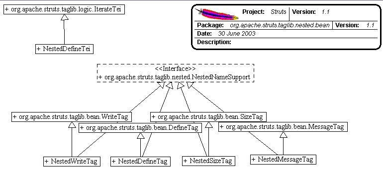

------------------------------------------------------------------------

 

<table>
<colgroup>
<col width="50%" />
<col width="50%" />
</colgroup>
<tbody>
<tr class="odd">
<td align="left">
<table>
<tbody>
<tr class="odd">
<td align="left"><a href="../../../../../../overview-summary.html.md"><strong>Overview</strong></a> </td>
<td align="left"> <strong>Package</strong> </td>
<td align="left">Class </td>
<td align="left"><a href="package-use.html.md"><strong>Use</strong></a> </td>
<td align="left"><a href="package-tree.html.md"><strong>Tree</strong></a> </td>
<td align="left"><a href="../../../../../../deprecated-list.html.md"><strong>Deprecated</strong></a> </td>
<td align="left"><a href="../../../../../../index-all.html.md"><strong>Index</strong></a> </td>
<td align="left"><a href="../../../../../../help-doc.html.md"><strong>Help</strong></a> </td>
</tr>
</tbody>
</table></td>
<td align="left"></td>
</tr>
<tr class="even">
<td align="left"> <a href="../../../../../../org/apache/struts/taglib/nested/package-summary.html.md"><strong>PREV PACKAGE</strong></a>   <a href="../../../../../../org/apache/struts/taglib/nested/html/package-summary.html"><strong>NEXT PACKAGE</strong></a></td>
<td align="left"><a href="../../../../../../index.html.md?org/apache/struts/taglib/nested/bean/package-summary.html"><strong>FRAMES</strong></a>    <a href="package-summary.html"><strong>NO FRAMES</strong></a>    
<a href="../../../../../../allclasses-noframe.html.md"><strong>All Classes</strong></a></td>
</tr>
</tbody>
</table>

------------------------------------------------------------------------

Package org.apache.struts.taglib.nested.bean
--------------------------------------------

The nested bean tags extend the `org.apache.struts.taglib.bean` tags to allow them to relate to each other in a nested nature.

**See:**
           [**Description**](#package_description)

**Class Summary**

**[NestedDefineTag](../../../../../../org/apache/struts/taglib/nested/bean/NestedDefineTag.html.md "class in org.apache.struts.taglib.nested.bean")**

NestedDefineTag.

**[NestedDefineTei](../../../../../../org/apache/struts/taglib/nested/bean/NestedDefineTei.html.md "class in org.apache.struts.taglib.nested.bean")**

NestedDefineTei to make sure that the implied setting of the name property of a nested tag is properly handed in the casting of the defined object.

**[NestedMessageTag](../../../../../../org/apache/struts/taglib/nested/bean/NestedMessageTag.html.md "class in org.apache.struts.taglib.nested.bean")**

NestedWriteTag.

**[NestedSizeTag](../../../../../../org/apache/struts/taglib/nested/bean/NestedSizeTag.html.md "class in org.apache.struts.taglib.nested.bean")**

NestedSizeTag.

**[NestedWriteTag](../../../../../../org/apache/struts/taglib/nested/bean/NestedWriteTag.html.md "class in org.apache.struts.taglib.nested.bean")**

NestedWriteTag.

 

Package org.apache.struts.taglib.nested.bean Description
--------------------------------------------------------

The nested bean tags extend the `org.apache.struts.taglib.bean` tags to allow them to relate to each other in a nested nature. The fundamental logic of the `org.apache.struts.taglib.bean` tags don't change, except in that all references to beans and bean properties will be managed in a nested context.
 

------------------------------------------------------------------------

 

<table>
<colgroup>
<col width="50%" />
<col width="50%" />
</colgroup>
<tbody>
<tr class="odd">
<td align="left">
<table>
<tbody>
<tr class="odd">
<td align="left"><a href="../../../../../../overview-summary.html.md"><strong>Overview</strong></a> </td>
<td align="left"> <strong>Package</strong> </td>
<td align="left">Class </td>
<td align="left"><a href="package-use.html.md"><strong>Use</strong></a> </td>
<td align="left"><a href="package-tree.html.md"><strong>Tree</strong></a> </td>
<td align="left"><a href="../../../../../../deprecated-list.html.md"><strong>Deprecated</strong></a> </td>
<td align="left"><a href="../../../../../../index-all.html.md"><strong>Index</strong></a> </td>
<td align="left"><a href="../../../../../../help-doc.html.md"><strong>Help</strong></a> </td>
</tr>
</tbody>
</table></td>
<td align="left"></td>
</tr>
<tr class="even">
<td align="left"> <a href="../../../../../../org/apache/struts/taglib/nested/package-summary.html.md"><strong>PREV PACKAGE</strong></a>   <a href="../../../../../../org/apache/struts/taglib/nested/html/package-summary.html"><strong>NEXT PACKAGE</strong></a></td>
<td align="left"><a href="../../../../../../index.html.md?org/apache/struts/taglib/nested/bean/package-summary.html"><strong>FRAMES</strong></a>    <a href="package-summary.html"><strong>NO FRAMES</strong></a>    
<a href="../../../../../../allclasses-noframe.html.md"><strong>All Classes</strong></a></td>
</tr>
</tbody>
</table>

------------------------------------------------------------------------

Copyright © 2000-2008 [Apache Software Foundation](http://www.apache.org/). All Rights Reserved.
