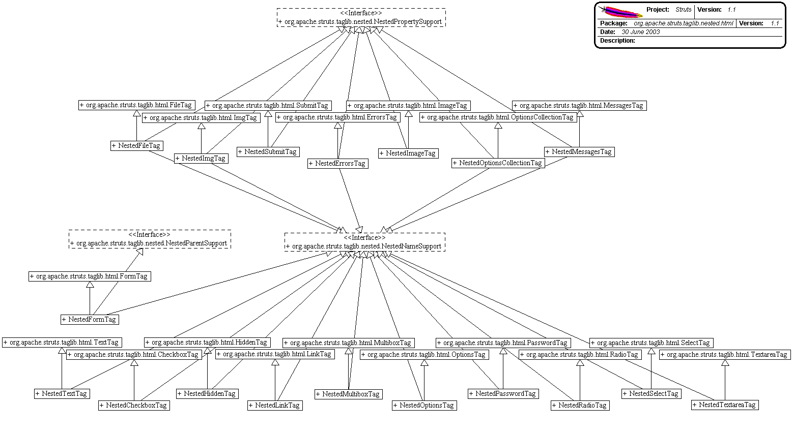

------------------------------------------------------------------------

 

<table>
<colgroup>
<col width="50%" />
<col width="50%" />
</colgroup>
<tbody>
<tr class="odd">
<td align="left">
<table>
<tbody>
<tr class="odd">
<td align="left"><a href="../../../../../../overview-summary.html.md"><strong>Overview</strong></a> </td>
<td align="left"> <strong>Package</strong> </td>
<td align="left">Class </td>
<td align="left"><a href="package-use.html.md"><strong>Use</strong></a> </td>
<td align="left"><a href="package-tree.html.md"><strong>Tree</strong></a> </td>
<td align="left"><a href="../../../../../../deprecated-list.html.md"><strong>Deprecated</strong></a> </td>
<td align="left"><a href="../../../../../../index-all.html.md"><strong>Index</strong></a> </td>
<td align="left"><a href="../../../../../../help-doc.html.md"><strong>Help</strong></a> </td>
</tr>
</tbody>
</table></td>
<td align="left"></td>
</tr>
<tr class="even">
<td align="left"> <a href="../../../../../../org/apache/struts/taglib/nested/bean/package-summary.html.md"><strong>PREV PACKAGE</strong></a>   <a href="../../../../../../org/apache/struts/taglib/nested/logic/package-summary.html"><strong>NEXT PACKAGE</strong></a></td>
<td align="left"><a href="../../../../../../index.html.md?org/apache/struts/taglib/nested/html/package-summary.html"><strong>FRAMES</strong></a>    <a href="package-summary.html"><strong>NO FRAMES</strong></a>    
<a href="../../../../../../allclasses-noframe.html.md"><strong>All Classes</strong></a></td>
</tr>
</tbody>
</table>

------------------------------------------------------------------------

Package org.apache.struts.taglib.nested.html.md
--------------------------------------------

The nested.html.md tags extend the `org.apache.struts.taglib.html` tags to allow them to relate to each other in a nested nature.

**See:**
           [**Description**](#package_description)

**Class Summary**

**[NestedCheckboxTag](../../../../../../org/apache/struts/taglib/nested.html.md/NestedCheckboxTag.html "class in org.apache.struts.taglib.nested.html")**

NestedCheckboxTag.

**[NestedErrorsTag](../../../../../../org/apache/struts/taglib/nested.html.md/NestedErrorsTag.html "class in org.apache.struts.taglib.nested.html")**

NestedErrorsTag.

**[NestedFileTag](../../../../../../org/apache/struts/taglib/nested.html.md/NestedFileTag.html "class in org.apache.struts.taglib.nested.html")**

NestedFileTag.

**[NestedFormTag](../../../../../../org/apache/struts/taglib/nested.html.md/NestedFormTag.html "class in org.apache.struts.taglib.nested.html")**

NestedFormTag.

**[NestedHiddenTag](../../../../../../org/apache/struts/taglib/nested.html.md/NestedHiddenTag.html "class in org.apache.struts.taglib.nested.html")**

NestedHiddenTag.

**[NestedImageTag](../../../../../../org/apache/struts/taglib/nested.html.md/NestedImageTag.html "class in org.apache.struts.taglib.nested.html")**

NestedMultiboxTag.

**[NestedImgTag](../../../../../../org/apache/struts/taglib/nested.html.md/NestedImgTag.html "class in org.apache.struts.taglib.nested.html")**

NestedImgTag, renders the nested version of the tag.

**[NestedLinkTag](../../../../../../org/apache/struts/taglib/nested.html.md/NestedLinkTag.html "class in org.apache.struts.taglib.nested.html")**

NestedLinkTag.

**[NestedMessagesTag](../../../../../../org/apache/struts/taglib/nested.html.md/NestedMessagesTag.html "class in org.apache.struts.taglib.nested.html")**

NestedMessagesTag.

**[NestedMultiboxTag](../../../../../../org/apache/struts/taglib/nested.html.md/NestedMultiboxTag.html "class in org.apache.struts.taglib.nested.html")**

NestedMultiboxTag.

**[NestedOptionsCollectionTag](../../../../../../org/apache/struts/taglib/nested.html.md/NestedOptionsCollectionTag.html "class in org.apache.struts.taglib.nested.html")**

NestedOptionsCollectionTag.

**[NestedOptionsTag](../../../../../../org/apache/struts/taglib/nested.html.md/NestedOptionsTag.html "class in org.apache.struts.taglib.nested.html")**

NestedOptionsTag.

**[NestedPasswordTag](../../../../../../org/apache/struts/taglib/nested.html.md/NestedPasswordTag.html "class in org.apache.struts.taglib.nested.html")**

NestedPasswordTag.

**[NestedRadioTag](../../../../../../org/apache/struts/taglib/nested.html.md/NestedRadioTag.html "class in org.apache.struts.taglib.nested.html")**

NestedRadioTag.

**[NestedSelectTag](../../../../../../org/apache/struts/taglib/nested.html.md/NestedSelectTag.html "class in org.apache.struts.taglib.nested.html")**

NestedSelectTag.

**[NestedSubmitTag](../../../../../../org/apache/struts/taglib/nested.html.md/NestedSubmitTag.html "class in org.apache.struts.taglib.nested.html")**

NestedSubmitTag.

**[NestedTextareaTag](../../../../../../org/apache/struts/taglib/nested.html.md/NestedTextareaTag.html "class in org.apache.struts.taglib.nested.html")**

NestedTextareaTag.

**[NestedTextTag](../../../../../../org/apache/struts/taglib/nested.html.md/NestedTextTag.html "class in org.apache.struts.taglib.nested.html")**

NestedTextTag.

 

Package org.apache.struts.taglib.nested.html.md Description
--------------------------------------------------------

The nested.html.md tags extend the `org.apache.struts.taglib.html` tags to allow them to relate to each other in a nested nature. The fundamental logic of the html tags don't change, except in that all references to beans and bean properties will be managed in a nested context.
 

------------------------------------------------------------------------

 

<table>
<colgroup>
<col width="50%" />
<col width="50%" />
</colgroup>
<tbody>
<tr class="odd">
<td align="left">
<table>
<tbody>
<tr class="odd">
<td align="left"><a href="../../../../../../overview-summary.html.md"><strong>Overview</strong></a> </td>
<td align="left"> <strong>Package</strong> </td>
<td align="left">Class </td>
<td align="left"><a href="package-use.html.md"><strong>Use</strong></a> </td>
<td align="left"><a href="package-tree.html.md"><strong>Tree</strong></a> </td>
<td align="left"><a href="../../../../../../deprecated-list.html.md"><strong>Deprecated</strong></a> </td>
<td align="left"><a href="../../../../../../index-all.html.md"><strong>Index</strong></a> </td>
<td align="left"><a href="../../../../../../help-doc.html.md"><strong>Help</strong></a> </td>
</tr>
</tbody>
</table></td>
<td align="left"></td>
</tr>
<tr class="even">
<td align="left"> <a href="../../../../../../org/apache/struts/taglib/nested/bean/package-summary.html.md"><strong>PREV PACKAGE</strong></a>   <a href="../../../../../../org/apache/struts/taglib/nested/logic/package-summary.html"><strong>NEXT PACKAGE</strong></a></td>
<td align="left"><a href="../../../../../../index.html.md?org/apache/struts/taglib/nested/html/package-summary.html"><strong>FRAMES</strong></a>    <a href="package-summary.html"><strong>NO FRAMES</strong></a>    
<a href="../../../../../../allclasses-noframe.html.md"><strong>All Classes</strong></a></td>
</tr>
</tbody>
</table>

------------------------------------------------------------------------

Copyright © 2000-2008 [Apache Software Foundation](http://www.apache.org/). All Rights Reserved.
