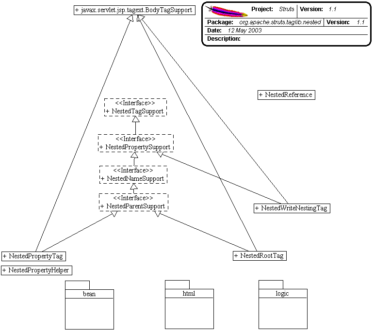

------------------------------------------------------------------------

 

<table>
<colgroup>
<col width="50%" />
<col width="50%" />
</colgroup>
<tbody>
<tr class="odd">
<td align="left">
<table>
<tbody>
<tr class="odd">
<td align="left"><a href="../../../../../overview-summary.html.md"><strong>Overview</strong></a> </td>
<td align="left"> <strong>Package</strong> </td>
<td align="left">Class </td>
<td align="left"><a href="package-use.html.md"><strong>Use</strong></a> </td>
<td align="left"><a href="package-tree.html.md"><strong>Tree</strong></a> </td>
<td align="left"><a href="../../../../../deprecated-list.html.md"><strong>Deprecated</strong></a> </td>
<td align="left"><a href="../../../../../index-all.html.md"><strong>Index</strong></a> </td>
<td align="left"><a href="../../../../../help-doc.html.md"><strong>Help</strong></a> </td>
</tr>
</tbody>
</table></td>
<td align="left"></td>
</tr>
<tr class="even">
<td align="left"> <a href="../../../../../org/apache/struts/taglib/logic/package-summary.html.md"><strong>PREV PACKAGE</strong></a>   <a href="../../../../../org/apache/struts/taglib/nested/bean/package-summary.html"><strong>NEXT PACKAGE</strong></a></td>
<td align="left"><a href="../../../../../index.html.md?org/apache/struts/taglib/nested/package-summary.html"><strong>FRAMES</strong></a>    <a href="package-summary.html"><strong>NO FRAMES</strong></a>    
<a href="../../../../../allclasses-noframe.html.md"><strong>All Classes</strong></a></td>
</tr>
</tbody>
</table>

------------------------------------------------------------------------

Package org.apache.struts.taglib.nested
---------------------------------------

Nested tags & supporting classes extend the base struts tags to allow them to relate to each other in a nested nature.

**See:**
           [**Description**](#package_description)

**Interface Summary**

**[NestedNameSupport](../../../../../org/apache/struts/taglib/nested/NestedNameSupport.html.md "interface in org.apache.struts.taglib.nested")**

This is so that managing classes can tell if a nested tag needs to have its *name* property set.

**[NestedParentSupport](../../../../../org/apache/struts/taglib/nested/NestedParentSupport.html.md "interface in org.apache.struts.taglib.nested")**

This interface is so managing classes of the nested tag can identify a tag as a parent tag that other tags retrieve nested properties from.

**[NestedPropertySupport](../../../../../org/apache/struts/taglib/nested/NestedPropertySupport.html.md "interface in org.apache.struts.taglib.nested")**

This interface is for managing classes of the nested extension, so they can know to set the tag's *property* property.

**[NestedTagSupport](../../../../../org/apache/struts/taglib/nested/NestedTagSupport.html.md "interface in org.apache.struts.taglib.nested")**

This is to simply allow managing classes to identify the tags to invoke common methods against them.

 

**Class Summary**

**[NestedPropertyHelper](../../../../../org/apache/struts/taglib/nested/NestedPropertyHelper.html.md "class in org.apache.struts.taglib.nested")**

A simple helper class that does everything that needs to be done to get the nested tag extension to work.

**[NestedPropertyTag](../../../../../org/apache/struts/taglib/nested/NestedPropertyTag.html.md "class in org.apache.struts.taglib.nested")**

NestedPropertyTag.

**[NestedReference](../../../../../org/apache/struts/taglib/nested/NestedReference.html.md "class in org.apache.struts.taglib.nested")**

So that a nested hierarchy can penetrate a dynamic JSP include, this class will hold the details of a bean name and nested property.

**[NestedRootTag](../../../../../org/apache/struts/taglib/nested/NestedRootTag.html.md "class in org.apache.struts.taglib.nested")**

NestedRootTag.

**[NestedWriteNestingTag](../../../../../org/apache/struts/taglib/nested/NestedWriteNestingTag.html.md "class in org.apache.struts.taglib.nested")**

NestedWriteNestingTag.

**[NestedWriteNestingTei](../../../../../org/apache/struts/taglib/nested/NestedWriteNestingTei.html.md "class in org.apache.struts.taglib.nested")**

NestedWriteNestingTei This class will allow the nested:writeNesting tag to actually do what the doc says and make a scripting variable as an option (when "id" is supplied).

 

Package org.apache.struts.taglib.nested Description
---------------------------------------------------

Nested tags & supporting classes extend the base struts tags to allow them to relate to each other in a nested nature. The fundamental logic of the original tags don't change, except in that all references to beans and bean properties will be managed in a nested context.
 

[ [Introduction](#doc.Intro)  ] [ [Foundation Concepts - model](#doc.FoundationConcepts)  ] [ [Foundation Concepts - tags](#doc.TaggingConcepts)  ] [ [Nested Tag List](#doc.TagList)  ] [ [The "property" Property](#doc.PropertyProperty)  ] [ [Implementation Details](#doc.ImplementationDetails)  ]

------------------------------------------------------------------------

### Introduction

The nesting extension provides the ability to define a nested object model and efficiently represent and manage that model through JSP's custom tags.

It's written in a layer that extends the current Struts tags, building on their logic and functionality. The layer enables the tags to be aware of the tags which surround them so they can correctly provide the nesting property reference to the Struts system. Struts already supported properties which use "dot notation" in accessing nested objects and properties.

    e.g. myProperty.childProperty.finalProperty

Because of this the controller servlet excellently manages this nested model. These tags are about bringing such ease of management to the JSP view of the architecture.

------------------------------------------------------------------------

### Foundation Concepts - model.

A bean holds a reference to another bean internally, and all access to that bean is handled through the current bean. This act of having one bean's access go through another bean is known as "nesting beans". The first bean is known as the parent bean. The bean which it references, is known as a child bean. The terms "parent" and "child" are commonly used to describe the model's hierarchy.

**A simple example...**
 Take an object which represents a monkey. The monkey's job is to pick bunches of bananas. On each bunch picked hangs many bananas. If this case was translated to bean objects, the monkey object would have a reference to the bunch objects he picked, and each bunch object would hold a reference to the bananas hanging in the bunch.

**To describe this...**
 The monkey object is the parent to the bunch object, and the bunch object is a child of the monkey object. The bunch object is parent to its child banana objects, and the child banana objects children of the bunch object. The monkey is higher in the hierarchy than the bananas, and the bananas lower in the hierarchy to the bunches.

One special term to remember is for the most parent class, which is known as the "root" object which starts the hierarchy.

------------------------------------------------------------------------

### Foundation Concepts - tags.

What the tags provide is an efficient way or representing the above models within JSP tag markup. As a result the tags take on similar relationships to each other. A tag can be the parent of another, and similarly be a child of a parent tag. However the most important part to remember, is that the properties of parent tags define the nested property for the child tags' properties.

One issue which may confuse the new developer, is that even though a tag is a parent tag in a markup sense (the opening tag and closing tag are either side of another tag) does not immediately mean that the child tag will be relative to that tag. Why? Some tags make bad parents. In other words, they're not logical steps in defining a hierarchy.

For example the relationship between the select tag and the options tag. The.html.md:options tag "must" be surrounded by a parent html:select tag.

    eg:
     .html.md:select name="myBean" property="mySelectProperty" >
        
     .html.md:options name="myBean" property="myOptionsProperty" >
        <.html.md:select>

In the nested context, this would cause undesired results if the select tag was a parent. The bean reference would become...

     mySelectProperty.myOptionsProperty

...which when translated, Struts would go to the value of the select property and then try to get your options list from that returned value. The extended logic tags are the same. You don't want to extend your properties within the objects the logic tags are evaluating.

To get manage this, the tags in the nested extension are categorised into parent tags and non-parent tags. Those which implement `org.apache.struts.taglib.nested.NestedParentSupport` are classed as parents, and the nested system knows they define levels in the nested hierarchy. Every other tag, does not, and will be skipped if found to be a "markup parent" (like our select tag) and not a "nested parent".

There are also the special case of starting off the hierarchy with a "root" tag. These tags are what the extension requires to provide them with the bean by which the structure will be based on.

------------------------------------------------------------------------

### Nested Tag List.

Here's a list of tags in the nested extension, grouped by parent/context functionality. "root", "nested parent", "markup parent" & "basic".

**Root Tags**

markup name

brief description

html:form

For backwards compatibility, you can use the typical form tag to implement your nested hierarchy.

nested:form

An extension of the above .html.md:form`, this is just to provide definition in the nested tag library.

nested:root

When you don't want to configure a form, you can use any bean which is in "scope" by specifying its name within this tag.

**Nested Parent Tags** (Affect the hierarchy)

markup name

brief description

nested:nest

This tag executes no logic, simply representing a nesting level for the rest of the markup to relate to.

nested:iterate

Extension of `logic:iterate` you can use it to iterate through a list, and have all child references nest within the beans returned from this iterated collection.

**Markup Parent Tags** (marked-up like parent tags, but don't affect the hierarchy)

markup name

brief description

nested:select

.html.md:select` extension. Provides the logic to render a select box in Html.

nested:empty

`logic:empty` extension.

nested:notEmpty

`logic:notEmpty` extension.

nested:equal

`logic:equal` extension.

nested:notEqual

`logic:notEqual` extension.

nested:greaterEqual

`logic:greaterEqual` extension.

nested:greaterThan

`logic:greaterThan` extension.

nested:lessEqual

`logic:lessEqual` extension.

nested:lessThan

`logic:lessThan` extension.

nested:match

`logic:match` extension.

nested:notMatch

`logic:notMatch` extension.

nested:present

`logic:present` extension.

nested:notPresent

`logic:notPresent` extension.

**Basic tags** (usually a tag which has no body content)

markup name

brief description

nested:checkbox

.html.md:` extension.

nested:hidden

.html.md:hidden` extension.

nested:define

`bean:define` extension.

nested:image

.html.md:image` extension.

nested:img

.html.md:img` extension.

nested:link

.html.md:link` extension.

nested:message

`bean:message` extension.

nested:multibox

.html.md:multibox` extension.

nested:options

.html.md:options` extension.

nested:optionsCollection

.html.md:optionsCollection` extension.

nested:password

.html.md:password` extension.

nested:radio

.html.md:radio` extension.

nested:select

.html.md:select` extension.

nested:size

`bean:size` extension.

nested:submit

.html.md:submit` extension.

nested:text

.html.md:text` extension.

nested:textarea

.html.md:textarea` extension.

nested:write

`bean:write` extension.

------------------------------------------------------------------------

### The relative references and the "property" property.

Use of the "property" property is exactly the same as the original Struts tag with minor addition. Appends the provided property to the nested property of the tags that surround it. You can use additional nesting (use "dot notation") within the provided property as the current struts system allows but there is now a tag which can provide this in a "cleaner" fashion. :)

The one other addition to the "property" property, is the ability to step backwards in the heirarchy in the familiar directory fashion; e.g. "../../myPropertyName"

As expected this allows you to step backwards in the nested model to access a higher level in the object tree. The implementation uses the StringTokenizer working off the "/" delimiter and counts the tokens. This was going to be denied, enforcing the ".." fashion, but on consideration, allowed for some easier-to-read naming possibilities.

Consider "propertyOne.propertyTwo.propertyThree.propertyFour". With the current nesting level beneath "propertyFour" you can instead use "two/three/four/anotherProperty" which is easier to understand than "../../../anotherProperty". Doesn't sound like much, but makes life easier when traversing large jsp pages for tags defining your object model.

Also implemented is the also familiar directory fashion of a leading "/" to reference from the root of the model and start over. e.g. "/propertyOne". This allow a convenient way to move around a few levels as well as "forking" in the object structure among other felixble approaches to structure.

**Parent References...**
 "property" properties, including the relative properties described above, all end up referencing a property of a child bean. For example "/myProperty" will return an object from the "myProperty" of the root bean. The fact that a property is specified means that you are accessing the result of that property. This results in never being able to properly access a parent object itself within its current related context.

Take for example you simply want to print out a list of String objects. In a bean you create a list of them, offer them out to the system via a getter, and you markup using the nested:iterate or logic:iterate tag (both contain the same issues). The only way to get at the object itself is get the iterate tag to declare a scripting variable. With the nested tags you can now simply reference the object using a parent reference of "./" or "this/". Any property ending in the "/" will be treaded as a parent reference. So if you use "parent/" as your property, it will step back one parent and use this block's parent. The special cases to use the parent of the current nested block are "./" or "this/". Not just the iterate tag, this will return the object represented by any nested parent tag.

This allows you to be in a nested tag block and use the custom tags work directly against the parent defined object, indexed or otherwise. So to be in an iterate block, and to print out the String representation of the current iterated object, you can now use...

    eg:
     <nested:iterate property="myItemList" >
     .html.md:write
        property="this/" > 
     <.html.md:iterate>

or if you want to print the string value of a parent the other side of the object...

    eg:
     <nested:iterate property="myBeanList" >
     <nested:iterate
        property="myItemList" >
     .html.md:write property="beanListObject/"
        > 
     <.html.md:iterate>
     <.html.md:iterate>

The fact that it didn't use the special cases of "./" or "this/" means that it steps back in the hierarchy as a typical relative reference. This is unlimited the amount of steps you can take back in the hierarchy. For example, to go back three parents your property would be "one/two/three/".

**Note:** The logic identifies the leading "/" and then reads the property from the last index of "/". Resulting in "/three/four/anotherProperty" working the same as "/anotherProperty".

**Note:** If you're busily nesting away, and a parent tag has a leading "/" property, the contained tags will append to this new structure. Handy, but you have to keep it in mind.

**Note:** If you try to reference beneath the level of the nesting, it will simply act like as if a leading "/" property was defined.

**Parent Reference Note:** The only thing to keep in mind with parent references is that you cannot parent reference the root bean. This is because the resulting property would be an empty string. Something that the BeanUtils/PropertyUtils cannot handle (if this is a requirement, you could use a "fake nested property". A getter which simply returns the same bean instance ("this") and simply add an extra `nested:nest` level at the start of your hierarchy. Works just fine).

------------------------------------------------------------------------

  

### Implementation Details.

**NestedPropertyHelper**

This class embodies all of the logic that runs the nested tagging system. It defines a static method, "setNestedProperties", which the nested tags pass themselves into to have their appropriate properties set.

The tag extensions themselves implement options of three interfaces which define functionality for the various types of nested usage. When traversing the tag hierarchy back up to the root of the structure, these tags define the result of the current tag.

**NestedTagSupport Interface...**

This is the base of the interfaces. Simply put, any tag that we need to single out of the standard struts tags for use by the nesting system can implement this or its children.

**NestedPropertySupport Interface...**

Tags that implement this interface will have the provided property attribute appended to the parenting nested attribute. This is the heart of the matter.

This is the basic property, and so far all the nested tags support this to have their nested properties written correctly.

**NestedNameSupport Interface...**

This interface means that the implementing tag wants to have it's name tag looked after by the nesting system. This is automatic, and the name is written for the tag from the root tag. If the JSP is a form, then it will look to the form tag and get a hold of the bean name that is defined in the struts-config.xml file for the action, otherwise, a nested:root tag must be provided for this means.

This extends the NestedPropertySupport interface as, at time of writing, all tags which used a "name" attribute, required a property attribute in some way to make it useful. This could change, and it's only a small refactoring to make it work for the instance if it's relevant for nesting.

**Note:** At the moment, if the tag implements this interface, the name attribute will be rewritten by the system on all counts. I find it hard to picture a valid requirement for inter-mixing multiple object structures (which distinguishable names would allow) in the one JSP page which couldn't be more efficiently provided by the current nesting model working over the one model. Time may prove this idea wrong.

**ParentTagSupport**

This tag identifies for the system those tags which define levels in the nested heirarchy. Namely the "getNestedProperty()" method that yields to calling tags the fully qualified nested property of the parent tag. In the case of a NestedIterator being the parent tag, it will also append the current index reference. e.g. propertyOne.propertyTwo[5]

------------------------------------------------------------------------

 

<table>
<colgroup>
<col width="50%" />
<col width="50%" />
</colgroup>
<tbody>
<tr class="odd">
<td align="left">
<table>
<tbody>
<tr class="odd">
<td align="left"><a href="../../../../../overview-summary.html.md"><strong>Overview</strong></a> </td>
<td align="left"> <strong>Package</strong> </td>
<td align="left">Class </td>
<td align="left"><a href="package-use.html.md"><strong>Use</strong></a> </td>
<td align="left"><a href="package-tree.html.md"><strong>Tree</strong></a> </td>
<td align="left"><a href="../../../../../deprecated-list.html.md"><strong>Deprecated</strong></a> </td>
<td align="left"><a href="../../../../../index-all.html.md"><strong>Index</strong></a> </td>
<td align="left"><a href="../../../../../help-doc.html.md"><strong>Help</strong></a> </td>
</tr>
</tbody>
</table></td>
<td align="left"></td>
</tr>
<tr class="even">
<td align="left"> <a href="../../../../../org/apache/struts/taglib/logic/package-summary.html.md"><strong>PREV PACKAGE</strong></a>   <a href="../../../../../org/apache/struts/taglib/nested/bean/package-summary.html"><strong>NEXT PACKAGE</strong></a></td>
<td align="left"><a href="../../../../../index.html.md?org/apache/struts/taglib/nested/package-summary.html"><strong>FRAMES</strong></a>    <a href="package-summary.html"><strong>NO FRAMES</strong></a>    
<a href="../../../../../allclasses-noframe.html.md"><strong>All Classes</strong></a></td>
</tr>
</tbody>
</table>

------------------------------------------------------------------------

Copyright © 2000-2008 [Apache Software Foundation](http://www.apache.org/). All Rights Reserved.
