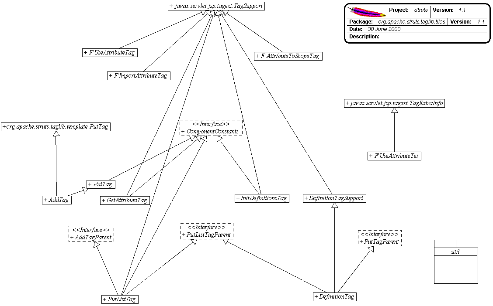

------------------------------------------------------------------------

 

<table>
<colgroup>
<col width="50%" />
<col width="50%" />
</colgroup>
<tbody>
<tr class="odd">
<td align="left">
<table>
<tbody>
<tr class="odd">
<td align="left"><a href="../../../../../overview-summary.html.md"><strong>Overview</strong></a> </td>
<td align="left"> <strong>Package</strong> </td>
<td align="left">Class </td>
<td align="left"><a href="package-use.html.md"><strong>Use</strong></a> </td>
<td align="left"><a href="package-tree.html.md"><strong>Tree</strong></a> </td>
<td align="left"><a href="../../../../../deprecated-list.html.md"><strong>Deprecated</strong></a> </td>
<td align="left"><a href="../../../../../index-all.html.md"><strong>Index</strong></a> </td>
<td align="left"><a href="../../../../../help-doc.html.md"><strong>Help</strong></a> </td>
</tr>
</tbody>
</table></td>
<td align="left"></td>
</tr>
<tr class="even">
<td align="left"> <a href="../../../../../org/apache/struts/tiles/definition/package-summary.html.md"><strong>PREV PACKAGE</strong></a>   <a href="../../../../../org/apache/struts/tiles/taglib/util/package-summary.html"><strong>NEXT PACKAGE</strong></a></td>
<td align="left"><a href="../../../../../index.html.md?org/apache/struts/tiles/taglib/package-summary.html"><strong>FRAMES</strong></a>    <a href="package-summary.html"><strong>NO FRAMES</strong></a>    
<a href="../../../../../allclasses-noframe.html.md"><strong>All Classes</strong></a></td>
</tr>
</tbody>
</table>

------------------------------------------------------------------------

Package org.apache.struts.tiles.taglib
--------------------------------------

The "struts-tiles" tag library contains tags that are useful in creating dynamic reusable components.

**See:**
           [**Description**](#package_description)

**Interface Summary**

**[AddTagParent](../../../../../org/apache/struts/tiles/taglib/AddTagParent.html.md "interface in org.apache.struts.tiles.taglib")**

Tag classes implementing this interface can contain nested `PutTag`s.

**[ComponentConstants](../../../../../org/apache/struts/tiles/taglib/ComponentConstants.html.md "interface in org.apache.struts.tiles.taglib")**

Constants used by Tiles/Components.

**[InsertTag.TagHandler](../../../../../org/apache/struts/tiles/taglib/InsertTag.TagHandler.html.md "interface in org.apache.struts.tiles.taglib")**

Inner Interface.

**[PutListTagParent](../../../../../org/apache/struts/tiles/taglib/PutListTagParent.html.md "interface in org.apache.struts.tiles.taglib")**

Tag classes implementing this interface can contains nested PutTag.

**[PutTagParent](../../../../../org/apache/struts/tiles/taglib/PutTagParent.html.md "interface in org.apache.struts.tiles.taglib")**

Tag classes implementing this interface can contain nested PutTag.

 

**Class Summary**

**[AddTag](../../../../../org/apache/struts/tiles/taglib/AddTag.html.md "class in org.apache.struts.tiles.taglib")**

Add an element to the surrounding list tag.

**[AttributeToScopeTag](../../../../../org/apache/struts/tiles/taglib/AttributeToScopeTag.html.md "class in org.apache.struts.tiles.taglib")**

**Deprecated.** *Is it still in use ?*

**[DefinitionTag](../../../../../org/apache/struts/tiles/taglib/DefinitionTag.html.md "class in org.apache.struts.tiles.taglib")**

This is the tag handler for \<tiles:definition\>, which defines a tiles (or template / component).

**[DefinitionTagSupport](../../../../../org/apache/struts/tiles/taglib/DefinitionTagSupport.html.md "class in org.apache.struts.tiles.taglib")**

Common base class for tags dealing with Tiles definitions.

**[GetAttributeTag](../../../../../org/apache/struts/tiles/taglib/GetAttributeTag.html.md "class in org.apache.struts.tiles.taglib")**

Retrieve the value of the specified component/template attribute property, and render it to the current JspWriter as a String.

**[GetTag](../../../../../org/apache/struts/tiles/taglib/GetTag.html.md "class in org.apache.struts.tiles.taglib")**

This is the tag handler for \<tiles:get\>, which gets content from the request scope and either includes the content or prints it, depending upon the value of the content's `direct` attribute.

**[ImportAttributeTag](../../../../../org/apache/struts/tiles/taglib/ImportAttributeTag.html.md "class in org.apache.struts.tiles.taglib")**

Import attribute from component to requested scope.

**[InitDefinitionsTag](../../../../../org/apache/struts/tiles/taglib/InitDefinitionsTag.html.md "class in org.apache.struts.tiles.taglib")**

Init definitions factory.

**[InsertTag](../../../../../org/apache/struts/tiles/taglib/InsertTag.html.md "class in org.apache.struts.tiles.taglib")**

This is the tag handler for \<tiles:insert\>, which includes a template.

**[PutListTag](../../../../../org/apache/struts/tiles/taglib/PutListTag.html.md "class in org.apache.struts.tiles.taglib")**

PutList tag implementation.

**[PutTag](../../../../../org/apache/struts/tiles/taglib/PutTag.html.md "class in org.apache.struts.tiles.taglib")**

Put an attribute in enclosing attribute container tag.

**[UseAttributeTag](../../../../../org/apache/struts/tiles/taglib/UseAttributeTag.html.md "class in org.apache.struts.tiles.taglib")**

Custom tag exposing a component attribute to page.

**[UseAttributeTei](../../../../../org/apache/struts/tiles/taglib/UseAttributeTei.html.md "class in org.apache.struts.tiles.taglib")**

Implementation of `TagExtraInfo` for the **UseAttribute** tag, identifying the scripting object(s) to be made visible.

 

Package org.apache.struts.tiles.taglib Description
--------------------------------------------------

The "struts-tiles" tag library contains tags that are useful in creating dynamic reusable components.

------------------------------------------------------------------------

 

<table>
<colgroup>
<col width="50%" />
<col width="50%" />
</colgroup>
<tbody>
<tr class="odd">
<td align="left">
<table>
<tbody>
<tr class="odd">
<td align="left"><a href="../../../../../overview-summary.html.md"><strong>Overview</strong></a> </td>
<td align="left"> <strong>Package</strong> </td>
<td align="left">Class </td>
<td align="left"><a href="package-use.html.md"><strong>Use</strong></a> </td>
<td align="left"><a href="package-tree.html.md"><strong>Tree</strong></a> </td>
<td align="left"><a href="../../../../../deprecated-list.html.md"><strong>Deprecated</strong></a> </td>
<td align="left"><a href="../../../../../index-all.html.md"><strong>Index</strong></a> </td>
<td align="left"><a href="../../../../../help-doc.html.md"><strong>Help</strong></a> </td>
</tr>
</tbody>
</table></td>
<td align="left"></td>
</tr>
<tr class="even">
<td align="left"> <a href="../../../../../org/apache/struts/tiles/definition/package-summary.html.md"><strong>PREV PACKAGE</strong></a>   <a href="../../../../../org/apache/struts/tiles/taglib/util/package-summary.html"><strong>NEXT PACKAGE</strong></a></td>
<td align="left"><a href="../../../../../index.html.md?org/apache/struts/tiles/taglib/package-summary.html"><strong>FRAMES</strong></a>    <a href="package-summary.html"><strong>NO FRAMES</strong></a>    
<a href="../../../../../allclasses-noframe.html.md"><strong>All Classes</strong></a></td>
</tr>
</tbody>
</table>

------------------------------------------------------------------------

Copyright © 2000-2008 [Apache Software Foundation](http://www.apache.org/). All Rights Reserved.
